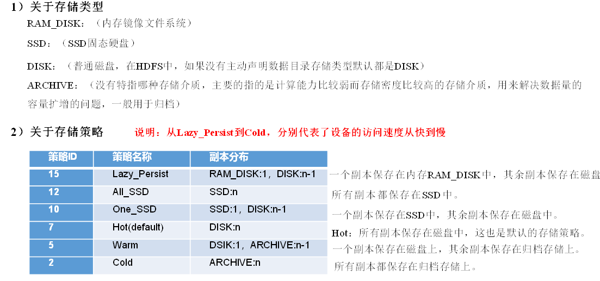
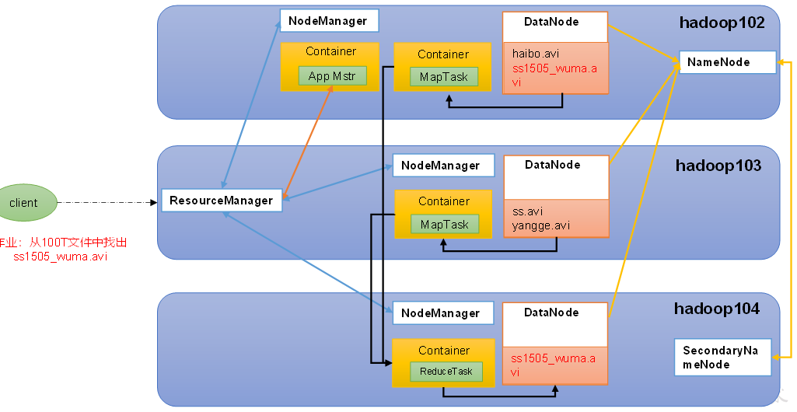

# Hadoop重点回顾

# 1. HDFS

## **1.1工作机制（面试重点）**

NameNode：存储文件的元数据，每个文件的块列表和块所在DN。

DataNode：存储文件块数据和检验和

SecondNameNode：用于协助NameNode存储备份数据

### (1)**文件块大小**

文件块默认是128M，当然这取决于读写速度，如果读写速度块可以是256。但是注意每个文件块占用空间约150M，因为除了存储的数据外，还会存索引相关信息。


几个端口：

8020：hdfs内部端口；9080：外部web端口。

### (2)**写数据流程**


（1）客户端通过Distributed FileSystem模块向NameNode请求上传文件，NameNode检查目标文件是否已存在，父目录是否存在。

（2）NameNode返回是否可以上传。

（3）客户端请求第一个 Block上传到哪几个DataNode服务器上。

（4）NameNode返回3个DataNode节点，分别为dn1、dn2、dn3。

（5）客户端通过FSDataOutputStream模块请求dn1上传数据，dn1收到请求会继续调用dn2，然后dn2调用dn3，将这个通信管道建立完成。

（6）dn1、dn2、dn3逐级应答客户端。

（7）客户端开始往dn1上传第一个Block（先从磁盘读取数据放到一个本地内存缓存），以Packet为单位，dn1收到一个Packet就会传给dn2，dn2传给dn3；dn1**每传一个packet（64k）会放入一个应答队列等待应答**。注意不是客户端直接发给每个DataNode的！！！

（8）当一个Block传输完成之后，客户端再次请求NameNode上传第二个Block的服务器。（重复执行3-7步）。

Q：怎么确认一个block是否完整？

A：检查每个checksum验证


### (3)**读数据流程**


（1）客户端通过RPC向NameNode请求下载文件，NameNode通过查询元数据，找到文件块所在的DataNode地址。

（2）挑选一台DataNode（就近原则，然后随机）服务器，请求读取数据。

（3）DataNode开始传输数据给客户端（从磁盘里面读取数据输入流，以Packet为单位来做校验。最小单位是chunk，但是会让chunk存到一个Packet大小后再传输）。

（4）客户端以Packet为单位接收，先在本地缓存，然后写入目标文件。

底层上本质是建立Socket Stream（FSDataInputStream），重复的调用父类**DataInputStream 的read** 方法，直到这个块上的数据读取完毕；

### (4)**NN和2NN工作机制**

Edit: 编辑文件，用来保存编辑的操作。分为Edit和Edit_inprogress，前者是要和fsimage合并的时候复制出来的，表示合并一段时间的计算结果。

Fsimage: 镜像文件，是元数据永久性的检查点，包含所有目录和inode序列化信息。

元数据需要存放在内存中。但如果只存在内存中，一旦断电，元数据丢失，整个集群就无法工作了。因此产生在磁盘中备份元数据的FsImage。


图中，”请求是否需要checkpoint“这里有两个触发条件：

​	到达更新周期：默认每隔一小时执行一次。

​	达到记录数上限：当操作数达到一百万时。

### (5)**NN和DN工作机制**

、

这里的第五点中的10分钟其实是预先设置值num，超过2*num+10*心跳就会被认为不可用。  

DN如何保证数据完整性方法：

（1）当DataNode读取Block的时候，它会计算CheckSum。

（2）如果计算后的CheckSum，与Block创建时值不一样，说明Block已经损坏。

## **1.2调优、源码、命令操作（开发重点）**

### (1) 调优

（记）1.NN和DN的内存配置

NN最小值1G，每增加100,0000个block。增加1G内存；DN最小值为4G，超过400,0000每增加100,0000增加1G

（记）2.NN线程数

NameNode有一个工作线程池，用来处理不同DataNode的并发心跳以及客户端并发的元数据操作，**默认值是10**。经验值为20*math.log(Num{集群数})。

3.开启回收站。网页上删除是不会到回收站的，只有hadoop fs -rm才会走回收站。

4.配置白名单、黑名单。白名单可以防止一些攻击，黑名单可以用来退役服务器。

（重要）5.存储优化

**纠删码：**

为了缓解存储多副本带来额外开销的压力，可以使用纠删码。只在系统中存储一份数据，但是这份数据是被处理过分布式存在多个节点上。另外还会存检验数据，即使丢失了其中几份数据，也能通过检验文件计算出原来的文件。他的分配过程是按M切等分。


常用RS-6-3-1024k：使用RS编码，每6个数据单元，生成3个校验单元，共9个单元，也就是说：这9个单元中，只要有任意的6个单元存在（不管是数据单元还是校验单元，只要总数=6），就可以得到原始数据。每个单元的大小是1024k=1024*1024=1048576。

**异构存储**

不同的数据存储在不同类型的硬盘中。



常见命令：

```shell
# 查看当前有哪些存储策略可以用
hdfs storagepolicies -listPolicies
# 为指定路径（数据存储目录）设置指定的存储策略
hdfs storagepolicies -setStoragePolicy -path xxx -policy xxx
```

6.故障排除

NameNode出问题：

```
删除./data/dfs/name/*  ; hdfs --daemon start namenode
```

集群安全模式和磁盘修复：

​	什么情况会进入安全模式：NN刚起来再从磁盘中fsimage和edit_in加载数据到内存中；NN再接收DataNode注册时，处于安全模式。安全模式结束自动退出。

（记）7.慢磁盘监控，用fio包来检测磁盘的读写性能，一旦效果不好可以把这个盘当作归档冷盘来处理。

（记）8.小文件归档：将小文件通过archive打包成一个har大文件来处理。

```shell
hadoop archive -archiveName input.har -p  /input   /output
```

### (2) 源码

1.RPC通信原理

不同线程间的通信，例如同设备上的客户端使用服务器方法需要用到RPC通信原理。

定义RPC接口：

```java
package com.atguigu.rpc;

public interface RPCProtocol {

    long versionID = 666;

    void mkdirs(String path);
}
```

服务器端：

```java
package com.atguigu.rpc;

import org.apache.hadoop.conf.Configuration;
import org.apache.hadoop.ipc.RPC;
import org.apache.hadoop.ipc.Server;

import java.io.IOException;

public class NNServer implements RPCProtocol{

    @Override
    public void mkdirs(String path) {
        System.out.println("服务端，创建路径" + path);
    }

    public static void main(String[] args) throws IOException {

        Server server = new RPC.Builder(new Configuration())
                .setBindAddress("localhost")
                .setPort(8888)
                .setProtocol(RPCProtocol.class)
                .setInstance(new NNServer())
                .build();

        System.out.println("服务器开始工作");

        server.start();
    }
}
```

客户端：

```java
package com.atguigu.rpc;

import org.apache.hadoop.conf.Configuration;
import org.apache.hadoop.ipc.RPC;

import java.io.IOException;
import java.net.InetSocketAddress;

public class HDFSClient {

    public static void main(String[] args) throws IOException {
        RPCProtocol client = RPC.getProxy(
                RPCProtocol.class,
                RPCProtocol.versionID,
                new InetSocketAddress("localhost", 8888),
                new Configuration());

        System.out.println("我是客户端");

        client.mkdirs("/input");
    }
}
```

2.NN启动源码


启动资源检查：**fsimage（默认100m） editLog（默认100m）**

3.DN启动源码


在connectToNNAndHandshake方法中获取NN proxy的对象。

4.上传源码


分为create过程和write过程。

### (3) 配置文件

Core-site.xml

```shell
<?xml version="1.0" encoding="UTF-8"?>
<?xml-stylesheet type="text/xsl" href="configuration.xsl"?>

<configuration>
    <!-- 指定NameNode的地址 -->
    <property>
        <name>fs.defaultFS</name>
        <value>hdfs://hadoop102:8020</value>
    </property>

    <!-- 指定hadoop数据的存储目录 -->
    <property>
        <name>hadoop.tmp.dir</name>
        <value>/opt/module/hadoop-3.1.3/data</value>
    </property>

    <!-- 配置HDFS网页登录使用的静态用户为atguigu -->
    <property>
        <name>hadoop.http.staticuser.user</name>
        <value>shanjh</value>
    </property>
</configuration>

```

hdfs-site.xml

```shell
<?xml version="1.0" encoding="UTF-8"?>
<?xml-stylesheet type="text/xsl" href="configuration.xsl"?>

<configuration>
	<!-- nn web端访问地址-->
	<property>
        <name>dfs.namenode.http-address</name>
        <value>hadoop102:9870</value>
    </property>
	<!-- 2nn web端访问地址-->
    <property>
        <name>dfs.namenode.secondary.http-address</name>
        <value>hadoop104:9868</value>
    </property>
</configuration>

```


### (4) 命令

1.Hadoop中Shell开发命令

```shell
# 从本地文件系统中拷贝文件到HDFS路径去
hadoop fs -put ./localpath /hdfspath

# 追加一个文件到已经存在的文件末尾
hadoop fs -appendToFile liubei.txt /sanguo/shuguo.txt

# 从HDFS拷贝到本地
hadoop fs -get /sanguo/shuguo.txt ./shuguo2.txt

#常见命令
hadoop fs -ls|mv|rm|tail|mkdir|chmod

# 初始化NameNode
hdfs namenode -format
```

2.HDFS的API

```java
public void testCopyFromLocalFile() throws IOException, InterruptedException, URISyntaxException {

    // 1 获取文件系统
    Configuration configuration = new Configuration();
    configuration.set("dfs.replication", "2");
    FileSystem fs = FileSystem.get(new URI("hdfs://hadoop102:8020"), configuration, "atguigu");

    // 2 上传文件
    fs.copyFromLocalFile(new Path("d:/sunwukong.txt"), new Path("/xiyou/huaguoshan"));

    // 3 关闭资源
    fs.close();
｝
```

当在Hadoop中编写MapReduce作业时，FileSystem、Configuration和Job类是三个重要的组件，它们之间有着密切的关系，并且各自扮演着不同的角色。

FileSystem（文件系统）：

FileSystem类是Hadoop中用于操作HDFS（Hadoop分布式文件系统）的主要类之一。
它负责处理文件的创建、读取、写入、删除等操作，并提供了访问HDFS的接口。
可以通过FileSystem类来创建输入路径和输出路径，以及获取文件信息等。

Configuration（配置）：

Configuration类用于管理Hadoop作业运行时的配置信息。
它存储了作业的各种配置选项，如输入路径、输出路径、Mapper类、Reducer类、Combiner类等。
可以在配置文件中指定默认配置，并在作业中修改和管理这些配置信息。

Job类：

Job类是Hadoop MapReduce作业的核心类，用于定义和配置MapReduce作业。
可以通过Job类设置作业的各种属性，如作业名称、输入路径、输出路径、Mapper类、Reducer类等。
Job类还可以配置作业的输入格式（InputFormat）和输出格式（OutputFormat），以及设置作业的其他参数。

# 2.MapReduce

## 2.1工作机制

### (1) 原理

**1.map-shuffle-reduce上：**


在map中切片很重要！**因为切片的数量决定了MapTask的数量。**

那么怎么切片？

默认情况了切片是TextInputFormat，即对每个文件进行单独切片，如果一个文件大于128兆，那么会被切成两块。切片公式如下：

```java
computeSplitSize(Math.max(minSize,Math.min(maxSize,blocksize)))=blocksize=128Mvc
```

还有一种方法是CombineInputFormat，不是按照文件来切片了，而是按照文件大小来秒如果文件够小那么会被合并成一个片。


**2.map-shuffle-reduce中：**


**环形缓冲区：**

​	分为左右两部分，左边存索引，右边存数据。缓冲区设置成80%然后反向写是因为写入磁盘的时候可以利用剩余空间先写完，等写完磁盘的数据也存完了那么原来那块空间就可以溢写了。

Q：写入到环形缓冲区前的key和value需要被序列化么？

A：按照hadoop writable的序列化要求转换，只需要记住String对应的是Text类型就行，其他类型后面加writable就行，如IntWritable。

**分区：**分区方法是可以自定义的。但是**最好分区数量就是reduce的输出数量**，这样不会产生空文件和数据丢失。

**分区合并：**分区合并的作用其实就是预先执行reduce，让后面reduce阶段的压力小一点。但是分区合并是有前提的，执行的分区合并不能影响业务，比如说reduce输出的是平均数，那么这个时候合并的结果就和原先不同了。

**读取分区数据：**reduce开启reduceTask来**拉取**每个分区中存储的数据。如果说数据太大就会被溢出到磁盘。

**3.map-shuffle-reduce下：**


当然reduceTask的数量设置多少还应该根据实际业务需求来。

**4.map/reduce join**（以word上的小米pid那个例子来）

Map端的主要工作：为来自不同表或文件的key/value对，**打标签以区别不同来源的记录**。然后用连接字段作为key，其余部分和新加的标志作为valu e，最后进行输出。

Reduce端的主要工作：在Reduce端**以连接字段作为key的分组已经完成**，我们只需要在每一个分组当中将那些来源于不同文件的记录（在Map阶段已经打标志）分开，最后进行合并就ok了。

### (2) 实现Map-reduce

 常见序列化（思考为什么要序列化？从自定义数据类型对象传输的角度来看）：如果是自定以对象序列化的话需要实现writableComparable重写write、readFields和compareTo方法，因为前两个在map传给reduce的时候要用，后者在分区时内部快排需要用到。


```java
@Override
public void write(DataOutput out) throws IOException {
	out.writeLong(upFlow);
	out.writeLong(downFlow);
	out.writeLong(sumFlow);
}
@Override
public void readFields(DataInput in) throws IOException {
	upFlow = in.readLong();
	downFlow = in.readLong();
	sumFlow = in.readLong();
}
@Override
public int compareTo(FlowBean o) {
	// 倒序排列，从大到小
	return this.sumFlow > o.getSumFlow() ? -1 : 1;
}

```

定义四个文件，driver、map、reduce和javabean（如果有的话）

driver：

```java
public class WordCountDriver {

	public static void main(String[] args) throws IOException, ClassNotFoundException, InterruptedException {

		// 1 获取配置信息以及获取job对象
		Configuration conf = new Configuration();
		Job job = Job.getInstance(conf);

		// 2 关联本Driver程序的jar
		job.setJarByClass(WordCountDriver.class);

		// 3 关联Mapper和Reducer的jar
		job.setMapperClass(WordCountMapper.class);
		job.setReducerClass(WordCountReducer.class);

		// 4 设置Mapper输出的kv类型
		job.setMapOutputKeyClass(Text.class);
		job.setMapOutputValueClass(IntWritable.class);

		// 5 设置最终输出kv类型
		job.setOutputKeyClass(Text.class);
		job.setOutputValueClass(IntWritable.class);
		
		// 6 设置输入和输出路径
		FileInputFormat.setInputPaths(job, new Path(args[0]));
		FileOutputFormat.setOutputPath(job, new Path(args[1]));

		// 7 提交job
		boolean result = job.waitForCompletion(true);
		System.exit(result ? 0 : 1);
	}
}

```

mapper：

```java
public class WordCountMapper extends Mapper<LongWritable, Text, Text, IntWritable>{
	
	Text k = new Text();
	IntWritable v = new IntWritable(1);
	
	@Override
	protected void map(LongWritable key, Text value, Context context)	throws IOException, InterruptedException {
		
		// 1 获取一行
		String line = value.toString();
		
		// 2 切割
		String[] words = line.split(" ");
		
		// 3 输出
		for (String word : words) {
			
			k.set(word);
			context.write(k, v);//context其实就是一个缓冲区对象，进入的是封装起来的shuffle过程了
		}
	}
}

```

reducer：

```java
public class WordCountReducer extends Reducer<Text, IntWritable, Text, IntWritable>{

int sum;
IntWritable v = new IntWritable();

	@Override
	protected void reduce(Text key, Iterable<IntWritable> values,Context context) throws IOException, InterruptedException {
		
		// 1 累加求和
		sum = 0;
		for (IntWritable count : values) {
			sum += count.get();
		}
		
		// 2 输出
         v.set(sum);
		context.write(key,v);
	}
}

```

要清楚知道map<LongWritable, Text, xxxx, xxx>方法的四个参数代表什么。前两个一般对应没什么特别含义的序号和数据内容。后两个是输出的key值和value值。这个要和reduce方法对应。

### (3)Hadoop数据压缩


gzip的压缩容量、速度等始终适合正常用。Lzo和snappy支持切片。

压缩率：Lzo<snappy<gzip<bzip2

速度：Lzo>snappy>gzip>bzip2

## 2.2 调优、源码操作

## （1）调优


## （2）配置

```shell
<configuration>
	<!-- 指定MapReduce程序运行在Yarn上 -->
    <property>
        <name>mapreduce.framework.name</name>
        <value>yarn</value>
    </property>
</configuration>
```

## 

# 3.Yarn

ResourceManager：调度整个集群资源

NodeManager：单个服务器老大

ApplicationManager：单个任务的老大

Container：封装了运行时所需要的资源

## （1）工作机制


这里注意第9步到第13步中，这里的申请容器是由hdfs来完成，但是启动是appmaster来完成的。

## （2）两个调度器

**容量调度器---FIFO、DRF**

​	特点：多队列、多用户、灵活性（自己队列有剩余，可以借给其他队列，要用了享有第一收回权）、容量保证（每个队列都有最低和最大上限）

​	资源分配算法：


**公平调度器---FIFO、Fair、DRF（根据CPU和资源需求两个因素分配）**

​	和容量调度器不同的地方在于调度算法的不同，特点是一样的。

​	资源分配算法(fair算法)：

​	

​	

## （3）Yarn、Hdfs和Mapreduce之间的关系：

​	

（4）生产参数


配置文件

```shell
<configuration>
    <!-- 指定MR走shuffle -->
    <property>
        <name>yarn.nodemanager.aux-services</name>
        <value>mapreduce_shuffle</value>
    </property>

    <!-- 指定ResourceManager的地址-->
    <property>
        <name>yarn.resourcemanager.hostname</name>
        <value>hadoop103</value>
    </property>

    <!-- 环境变量的继承 -->
    <property>
        <name>yarn.nodemanager.env-whitelist</name>
        <value>JAVA_HOME,HADOOP_COMMON_HOME,HADOOP_HDFS_HOME,HADOOP_CONF_DIR,CLASSPATH_PREPEND_DISTCACHE,HADOOP_YARN_HOME,HADOOP_MAPRED_HOME</value>
    </property>
</configuration>
```

