# Hive

# 1.初始Hive

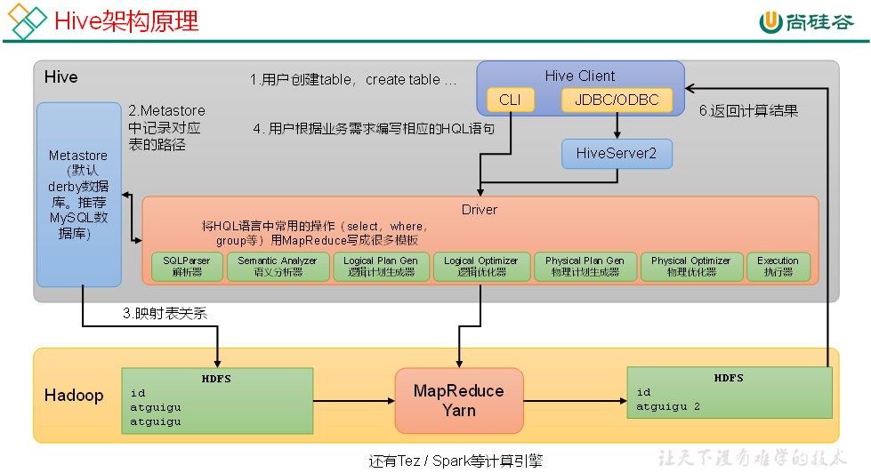

Hive中的表在Hadoop中是目录；Hive中的数据在Hadoop中是文件。所以Hive中的每张表的元数据都是放在mysql下，但是不会每次都从中取而是会预先加载到内存，然后实际的数据放在hdfs中下，默认路径是hdfs的/usr/shanjh/warehouse/tablename

hive日志目录：/tmp/shanjh/hive.log

## **1.1元数据库**

其数据库（默认是default）、表名、表的拥有者、列/分区字段、表的类型（是否是外部表）、表的数据所在目录等。

Hive默认使用的元数据库为**derby**。**derby**库的特点是同一时间只允许一个客户端访问。如果多个Hive客户端同时访问，就会报错。如果是多人协作开发，怎么解决呢？我们可以将Hive的元数据改为用MySQL存储，MySQL支持多客户端同时访问。

用mysql更换metastore数据库步骤：卸载derby数据库和原先的metastore  -> 安装mysql  -> 在mysql中创建metastore库  -> 初始化hive将mysql绑定  

```
[atguigu@hadoop102 hive]$ bin/schematool -dbType mysql -initSchema -verbose
```

## 1.2 HiveServer2

Hive的hiveserver2服务的作用是提供jdbc/odbc接口，为用户提供远程访问Hive数据的功能，理解为Hive的代理就行。

*Question：* 访问Hadoop集群的用户身份是谁？

*Answer：*    两种访问模式：以登录JDBC的客户端身份，以HiveServer2的登陆用户。通过调节hive.server2.enable.doAs参数来调节。默认是不启用。

**未启用用户模拟功能：**

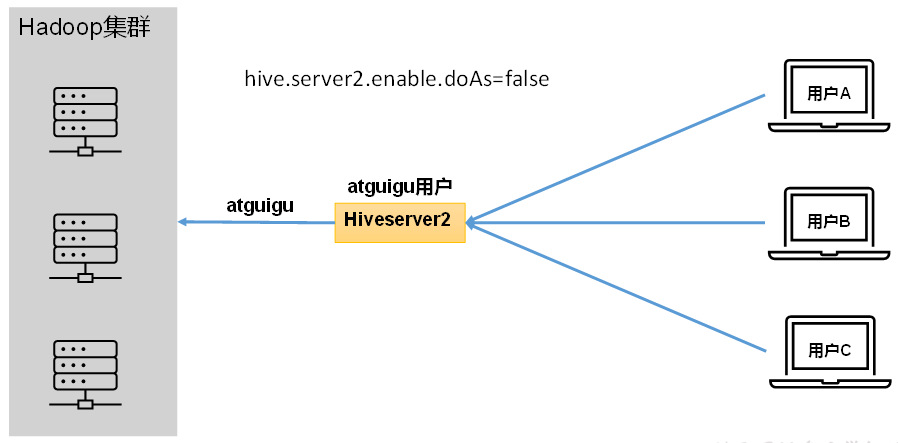

**启用用户模拟功能：**

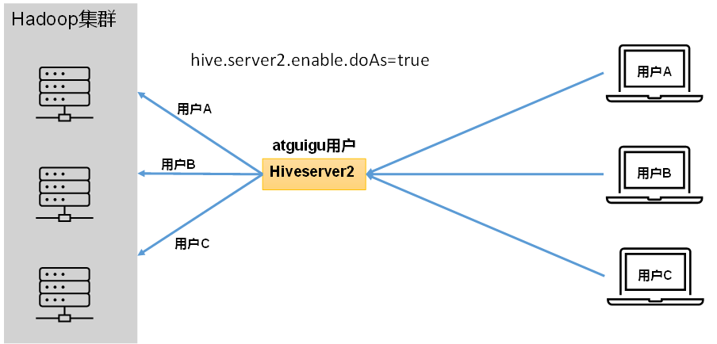

生产环境，推荐开启用户模拟功能，因为开启后才能保证各用户之间的权限隔离。

**启动metastore和hiveserver2**

```
[shanjh@hadoop102 hive]$ nohup hive --service metastore 2>&1 &
[shanjh@hadoop102 hive]$ nohup bin/hiveserver2 >/dev/null 2>&1 &
```

\>/dev/null: 这个部分将程序的标准输出重定向到 /dev/null。/dev/null 是一个特殊的设备文件，会立即丢弃所有写入它的数据。这意味着程序的输出将被丢弃，而不会在终端上显示。

2>&1: 这个部分将程序的标准错误输出 (stderr) 重定向到标准输出 (stdout)。这样做是为了确保所有输出都被重定向到 /dev/null，从而使程序在后台运行时不会产生任何输出。

&: 这个符号用于将命令放入后台运行

**配置hive-site.xml** 

​	jdbc驱动、url、user、pwd；

​	存放数据的路径/user/hive/warehouse;

​	端口号10000；

# 2.常用指令

## 2.1 DDL（Data Definition Language）数据定义

**创建库**

```
CREATE DATABASE [IF NOT EXISTS] database_name
[COMMENT database_comment]
[LOCATION hdfs_path]
[WITH DBPROPERTIES (property_name=property_value, ...)];
```

**查询库**

```
SHOW DATABASES [LIKE 'identifier_with_wildcards'];
DESCRIBE DATABASE [EXTENDED] db_name;
```

注：like通配表达式说明：*表示任意个任意字符，|表示或的关系。注意和后面的匹配规则中的%作区分

**修改库**

--修改dbproperties

```
ALTER DATABASE database_name SET DBPROPERTIES (property_name=property_value, ...);
```

--修改location

```
ALTER DATABASE database_name SET LOCATION hdfs_path;
```

--修改owner user

```
ALTER DATABASE database_name SET OWNER USER user_name;
```

**删除库**

```
DROP DATABASE [IF EXISTS] database_name [RESTRICT|CASCADE];

注：RESTRICT：严格模式，若数据库不为空，则会删除失败，默认为该模式。

  CASCADE：级联模式，若数据库不为空，则会将库中的表一并删除。
```

**建表一：**

```mysql
CREATE [TEMPORARY] [EXTERNAL] TABLE [IF NOT EXISTS] [db_name.]table_name   
[(col_name data_type [COMMENT col_comment], ...)]
[COMMENT table_comment]
[PARTITIONED BY (col_name data_type [COMMENT col_comment], ...)]
[CLUSTERED BY (col_name, col_name, ...) 
[SORTED BY (col_name [ASC|DESC], ...)] INTO num_buckets BUCKETS]
[ROW FORMAT row_format] 
[STORED AS file_format]
[LOCATION hdfs_path]
[TBLPROPERTIES (property_name=property_value, ...)]
```

- 内部表数据由Hive 自身管理，外部表数据由HDFS 管理；
- 临时表：该表只在当前会话课件，会话结束表会被删除（元数据和存储数据）。
- 外部表：删除表格时，仅删除元数据(meta data)。即仅删除表格，不会删除元数据。如果发现错误删除表格，可以把重新建表，然后把数据load回新表中。
- 内部表数据存储的位置是hive.metastore.warehouse.dir（默认：/user/hive/warehouse），外部表数据的存储位置由自己制定（如果没有LOCATION，Hive 将在HDFS 上的/user/hive/warehouse 文件夹下以外部表的表名创建一个文件夹，并将属于这个表的数据存放在这里）；

基本数据类型和mysql基本一致，不同的是多了String这个类型，就不用再像之前那样用varchar(n)来定义长度了。

另外还有三个复杂数据类型：Array，Map， Struct。

定义：

```mysql
create table test(
	col1 Array<String>, col2 Map<String, int>, col3 Struct<name:string,value:int,data:date>
)
```

使用：

```mysql
Array： arr[i]		return：value
Map:  	map['key']  return：value
struct：	struct.name
```

**-- Row format**

指定serde（序列化和反序列化）

```mysql
row format delimated [
fields terminated by |		列分隔符
collection items terminated by |	map、struct、array每个元素之间的分隔符
map keys terminated by |		map中的key和value的分隔符
lines terminated by				行分隔符
]'split';
```

如果待解析文件是Json，那么要使用row format **serde 'org.apache.hadoop.hive.serde2.JsonSerDe'**

```mysql
row format serde 'org.apache.hadoop.hive.serde2.JsonSerDe'
```

**--stored as**

指定存储在hdfs上的文件格式，常用的文件格式有，textfile（默认值），sequence file，orc file、parquet file等等。

**建表二：**

按照查询的结果来建表。

```mysql
CREATE [TEMPORARY] TABLE [IF NOT EXISTS] table_name 
[COMMENT table_comment] 
[ROW FORMAT row_format] 
[STORED AS file_format] 
[LOCATION hdfs_path]
[TBLPROPERTIES (property_name=property_value, ...)]
[AS select_statement]
```

**建表三：**

按照现有表来建表，只建表的格式没有数据。

```mysql
CREATE [TEMPORARY] [EXTERNAL] TABLE [IF NOT EXISTS] [db_name.]table_name
[LIKE exist_table_name]
[ROW FORMAT row_format] 
[STORED AS file_format] 
[LOCATION hdfs_path]
[TBLPROPERTIES (property_name=property_value, ...)]
```

set mapreduce.framework.name=local； 	指将maptask和reducetask执行在一个节点的一个线程上。

**查看表、修改表、删除表：**

```mysql
SHOW TABLES [IN database_name] LIKE ['identifier_with_wildcards'];
# *表示任意个任意字符
DESCRIBE [EXTENDED | FORMATTED] [db_name.]table_name;


ALTER TABLE table_name RENAME TO new_table_name;
ALTER TABLE table_name ADD COLUMNS (col_name data_type [COMMENT col_comment], ...)
ALTER TABLE table_name CHANGE [COLUMN] col_old_name col_new_name column_type [COMMENT col_comment] [FIRST|AFTER column_name]
DROP TABLE [IF EXISTS] table_name;
TRUNCATE [TABLE] table_name;
--注意：truncate只能清空管理表，不能删除外部表中数据。
```

## 2.2 DML

**Load:**

其本质其实是hdfs操作，当此时的用户是jdbc客户端的时候，那么load就是在执行-put命令，如果是hiveserver2客户端那么就是-mv操作；

```
LOAD DATA [LOCAL] INPATH 'filepath' [OVERWRITE] INTO TABLE tablename [PARTITION (partcol1=val1, partcol2=val2 ...)];
```

**Insert：**

```mysql
-- ① 将查询结果插入
INSERT (INTO | OVERWRITE) TABLE tablename [PARTITION (partcol1=val1, partcol2=val2 ...)] select_statement;
-- ② 直接插入值（不常用）
INSERT (INTO | OVERWRITE) TABLE tablename [PARTITION (partcol1[=val1], partcol2[=val2] ...)] VALUES values_row [, values_row ...]
-- ③ 将查询结果写入目标路径（不常用）
INSERT OVERWRITE [LOCAL] DIRECTORY directory
  [ROW FORMAT row_format] [STORED AS file_format] select_statement;
```

**Export & Import：**

Export和Import可用于两个Hive实例之间的数据迁移。

```
--导出
EXPORT TABLE tablename TO 'export_target_path'

--导入
IMPORT [EXTERNAL] TABLE new_or_original_tablename FROM 'source_path' [LOCATION 'import_target_path']
```

## 2.3 DQL

注：基本语法和mysql一致，这里就把有出入的地方和我不太熟悉的列进来了。

**limit：**

```
hive (default)> select * from emp limit 5; 
hive (default)> select * from emp limit 2,3; -- 表示从第2行开始，向下抓取3行
```

join的四种类型：内连接、左连接、右连接、满连接（左右连接）、笛卡尔积（全部情况）

union & unionall：前者是会查重，后者不查重。

排序：Order by、 Sort By、 Distribute By、Cluster By

order by：通常不单独用，因为从mapreduce的角度看，orderby是对每行数据都要作reduce的操作所以性能会下降很多，一般对搭配limit使用。

Sort by： 指定分区内的排序，**每个Reduce内部进行排序**。

Distribute By： 指定对分区的排序，即要那行数据进入到哪个reduce内。

Cluster By：结合Sort by和Distribute By。

# 3.函数

## 3.1单行函数：

**（1）数值函数：**round、ceil、floor

**（2）字符串函数：**subString（下表从1开始，如果不指定长度就会取到最后一个数）、concat（等价||）、replace（替换的是全部）、regexp_replace、regexp、split(返回数组)、nvl（等价于ifnull，用来初始化默认值）

regexp_replace：

```
select regexp_replace('100-200', '(\\d+)', 'num')
```

regexp：

```
hive> select 'dfsaaaa' regexp 'dfsb+';
```

**get_json_object**：**解析json字符串**

什么是JSON，常见JSON的数据结构有哪些？（单值、数组[]、对象{}）

```
hive> select get_json_object('[{"name":"大海海","sex":"男","age":"25"},{"name":"小宋宋","sex":"男","age":"47"}]','$.[0].name');
```

**（3）日期函数：**unix_timestamp：返回当前或指定时间的时间戳、unix_timestamp：返回当前或指定时间的时间戳、current_date、datediff、date_add、month（要求时间是标准格式的）、year、day

**（4）流程函数：**

case：

```mysql
-- 语法1
select 
	case 
		when A then B
		when C then D
		else
	end
from 
-- 语法2
select 
	case a
		when a=A then B
		when a=C then D
		else
	end
from 
```

if : 

语法：if（boolean testCondition, T valueTrue, T valueFalseOrNull）

返回值：T 

说明：当条件testCondition为true时，返回valueTrue；否则返回valueFalseOrNull

**（5）集合函数：**

 size

array()、sort_array、array_contain

map、map_keys、map_values()

struct、named_struct

## **3.2高级聚合函数**

collect_list、collect_set

## **3.3炸裂函数**

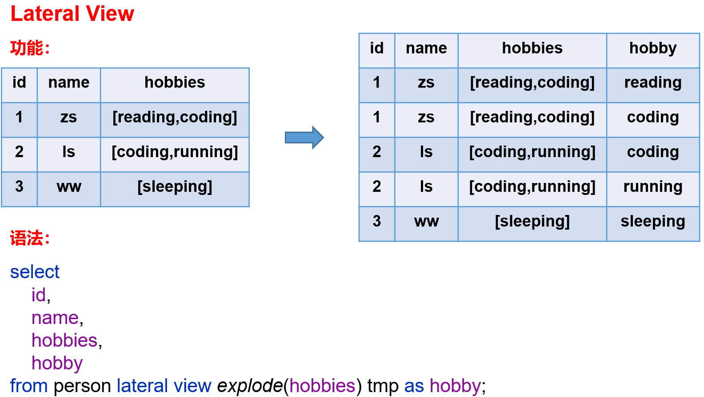

explode（）、posexplode（）、inline

## **3.4窗口函数**

每行数据划分一个窗口，对每个窗口进行函数计算。

```
函数（amount） over（窗口范围）
```

**(1) 划分窗口**

划分窗口的四个字段值：unbounded preceding(上界无穷)、[num] preceding(前n项)、current row、[num] following（后n项）、unbounded following(下界无穷)

**按行划分**：rows，字段就四个，保证and前面的小于后面的就行。
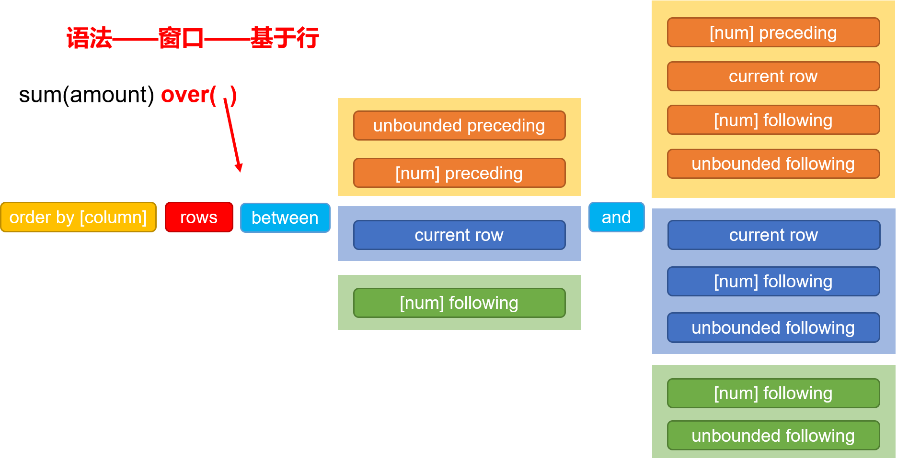

**按值划分**：range

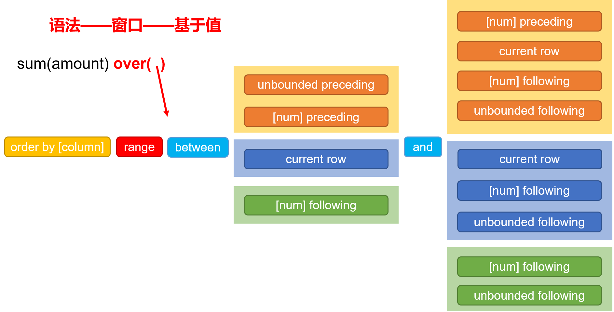

**分区**：按照字段的值进行划分，如：

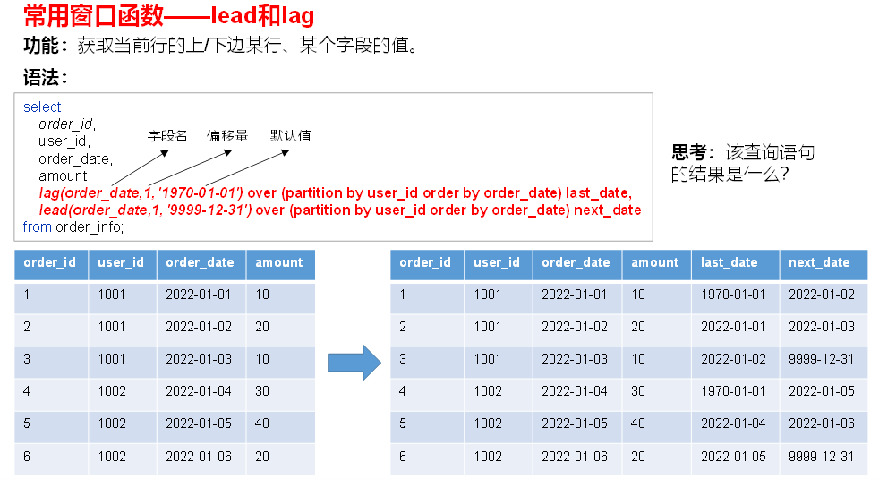

**缺省条件**：

partition by省略不写，表示不分区。order by就别省略了。

（rows|range）between .. and ... 省略不写时，若有order by 默认为range between unbounded preceding and current now，

若没有就是 rows between unbounded preceding and unbounded following。

(2) 函数

通常和聚合函数搭配使用，如min、max、sum、avg、count。

**lead和lag**


**注：lag和*lead函数不支持自定义窗口。**

**first_value和last_value**

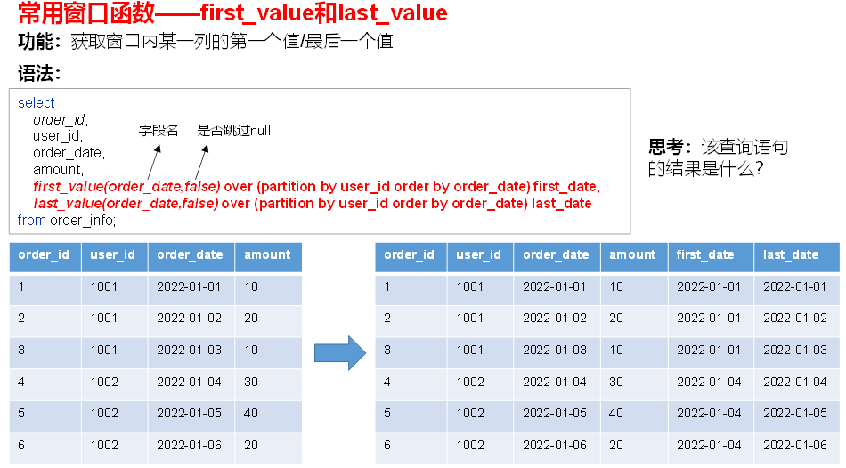

**排名函数：**

rank、dense_rank和row_number。

```
-- 直接使用函数
SELECT score,
ROW_NUMBER() OVER (partition by course ORDER BY score DESC) ranking
FROM score;
```

# 4.分区

## 4.1分区表

**作用：**将一张大的表拆分成不同的区表来存储。二级分区表同理是将分区表进一步进行拆分存储。它的实际意义在于可以将不同日期的表拆分成分区表来存储。

**从查询分区表上体现：**它的分区信息就会变成一个**字段信息**体现出来。这意味着我们在进行查询和插入等操作都只需要在where中匹配字段信息进行了。

```mysql
select deptno, dname, loc
from dept_partition where day = '2022-04-01';
```

**物理底层上：**创建一张分区表其实是在元数据中添加了一条**分区信息**、在hdfs中添加了一条**路径信息**。若分区表为外部表，用户执行drop partition命令后，分区元数据会被删除，而HDFS的分区路径不会被删除。

相关操作：

```mysql
-- 创建分区表
create table dept_partition
(
    deptno int,
    dname string,
    loc string
)
partitioned by (day string)
row format delimited fields terminated by '\t';

-- 加载数据
load data local inpath '/opt/module/data/dept_20220401.log' overwrite into table dept_partition partition(day='20220401');

--  查询该表的所有分区
show partitions dept_partition;

-- 在不同分区插入数据
insert into table dept_partition partition(day='20220402')
select deptno, dname, loc
from dept_partition where day = '2022-04-01';

-- 添加或删除分区信息
alter table dept_partition add partition(day='20220403');
alter table dept_partition drop partition(day='20220403');
```

**二级分区表：**

```mysql
create table dept_partition2(
    deptno int,    -- 部门编号
    dname string, -- 部门名称
    loc string     -- 部门位置
)
partitioned by (day string, hour string)
row format delimited fields terminated by '\t';

load data local inpath '/opt/module/data/dept_20220401.log'
into table dept_partition2
partition(day='20220401', hour='12');
```

**分区修复：**

有时，我们不小心删除了hdfs上的分区路径，这就导致和元数据库上的信息不同步。这个时候我们通常以**hdfs的路径为准**，来删除/添加元数据库中的分区信息。

```mysql
-- 在元数据库中添加分区信息
alter table dept_partition add partition (day='20220402');
-- 在元数据库中删除分区信息
alter table dept_partition drop partition (day='20220402');
-- 以hdfs路径去比对元数据库。如果不指定，那么默认是add
msck repair table table_name [add/drop/sync partitions];
```

## 4.2 分桶表

**作用：**对一张表按照某个**hash算法**来进行分区存储。如果这张表是分区表，那么将对每个分区进行分桶。可以理解为是shuffle中的分区算法那种意思。

**物理上的意义：**倘若指定**分桶数为4**，那么最终一份文件会变成**4份文件来存储**。理解为将数据文件进行划分。

**语法：**

```mysql
create table stu_buck(
    id int, 
    name string
)
clustered by(id) 
into 4 buckets
row format delimited fields terminated by '\t';
```

其装载数据和插入数据都和其他的方法一致。

**分桶排序表**

```mysql
create table stu_buck_sort(
    id int, 
    name string
)
clustered by(id) sorted by(id)
into 4 buckets
row format delimited fields terminated by '\t';
```

# 5.文件格式

Hadoop不同压缩的优缺点概述：bzip2和LZO可以切片。要求极端压缩率的bzip2最好，适合大文件但是速度慢；要求极端速度的LZO最好，但是压缩比高。比较适中的Gzip压缩率高速度快些，Snappy的速度快压缩率高些。

## 5.1Hive中的文件格式

**Text File：**默认的文件格式。按**行**在底层中存储。

**ORC：**列式存储的文件格式，能提高Hive读写数据和处理数据的性能。在Hive中的大部分操作只要少数几个字段来的，也是就是列式查询，所以列比行好些。

存储格式：

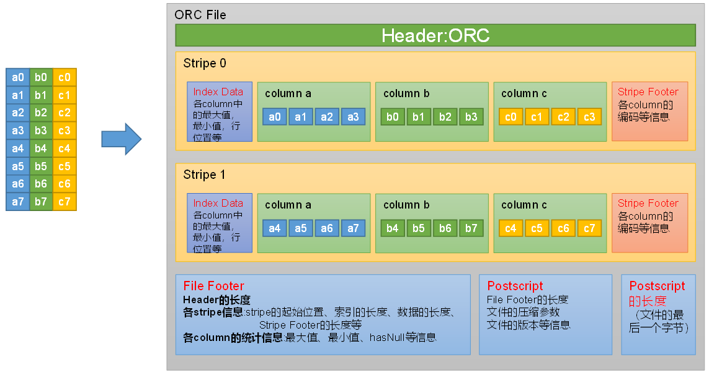

读数据的话式从后往前读，依次Postscript的长度、Postscript、FileFooter、Strip。

```
create table orc_table
(column_specs)
stored as orc
tblproperties (property_name=property_value, ...);
```

**Parquet：**列式存储的文件格式。


读数据的话会跳过头尾PAR1（4个字节）。和ORC的区别在于是否集中存储了索引信息，Parquet里面的元数据存储和RowGRoup的存储格式一致。

```
Create table parquet_table
(column_specs)
stored as parquet
tblproperties (property_name=property_value, ...);
```


# 6.调优

## 6.1计算资源调优

计算资源的调优是对内存和cpu的优化。

（1）在yarn-site中的配置：

配置NodeManager内存和cpu：

```shell
# 此处可将该参数设置为64G（调总内存的1/2~2/3）
<property>
    <name>yarn.nodemanager.resource.memory-mb</name>
    <value>65536</value>
</property>
# 此处可将该参数设置为16（1个核差不多4个G）
<property>
    <name>yarn.nodemanager.resource.cpu-vcores</name>
    <value>16</value>
</property>
```

配置container的最大和最小内存上限

```shell
<property>
    <name>yarn.scheduler.maximum-allocation-mb</name>
    <value>16384</value>
</property>

<property>
    <name>yarn.scheduler.minimum-allocation-mb</name>
    <value>512</value>
</property>
```

（2）配置mapreduce

设置单个map任务的内存和cpu：不能超过container的内存上下限

```mysql
set  mapreduce.map.memory.mb=2048;
set  mapreduce.map.cpu.vcores=1;
```

设置单个reduce任务的内存和cpu：不能超过container的内存上下限

```mysql
set mapreduce.reduce.memory.mb=1024;
set mapreduce.reduce.cpu.vcores=1;
```

## 6.2分组聚合优化

Hive对分组聚合的优化主要围绕着减少Shuffle数据量进行，具体做法是map-side聚合。就是在map operator端通过维护一个hash表先进行分组聚合一部分数据。

优点是速度快了，因为reduce少了；缺点是如果数据量大那么hash表存不下就会导致多次flush到磁盘也会降低效率。

```mysql
-- 启用map-side聚合（默认是true）
set hive.map.aggr=true;

-- 用于检测源表数据是否适合进行map-side聚合。检测的方法是：先对若干条数据进行map-side聚合，若聚合后的条数和聚合前的条数比值小于该值，则认为该表适合进行map-side聚合；否则，认为该表数据不适合进行map-side聚合，后续数据便不再进行map-side聚合。
set hive.map.aggr.hash.min.reduction=0.5;

-- side聚合的条数，就是上面预演的条数。
set hive.groupby.mapaggr.checkinterval=100000;

-- map-side聚合所用的hash table，占用map task堆内存（就是上面调的mapreduce.map.memory.mb）的最大比例，若超出该值，则会对hash table进行一次flush。
set hive.map.aggr.hash.force.flush.memory.threshold=0.9;
```

## 6.3Join优化

**common join：**这就是默认的join方式，利用读表然后放到reduce执行。但是问题就是shuffle会拖慢速度，所以要对其优化。

### **（1）map join：**

依照小表做出hash表放入到内存中，如果存在join关联，那么其他表只需要通过从内存读入并且在map端操作就可以了，而**不需要reduce和shuffle**。

map join的优化是基于表大小来作的，基本操作有：

```mysql
-- 查看表或分区大小
desc formatted table_name partition(partition_col='partition');

-- 自动转换
set hive.auto.convert.join=true;

-- 是否执行条件任务
set hive.auto.convert.join.noconditionaltask=true;

-- 条件任务中的容量预定值，实际场景配maptask缓存的（1/2~2/3，然后差不多要除个10）
set hive.mapjoin.smalltable.filesize=25285707; 

-- 非条件任务中的容量预定值
set hive.auto.convert.join.noconditionaltask.size=25286076;
```

smalltable.filesize的大小怎么配？这个参数是要读入文件在**磁盘**中的大小，而从磁盘读入到内存后一般数量会增大到十倍左右，所以在配置的时候需要注意会不会造成内存溢出的情况。

**map join工作原理：**

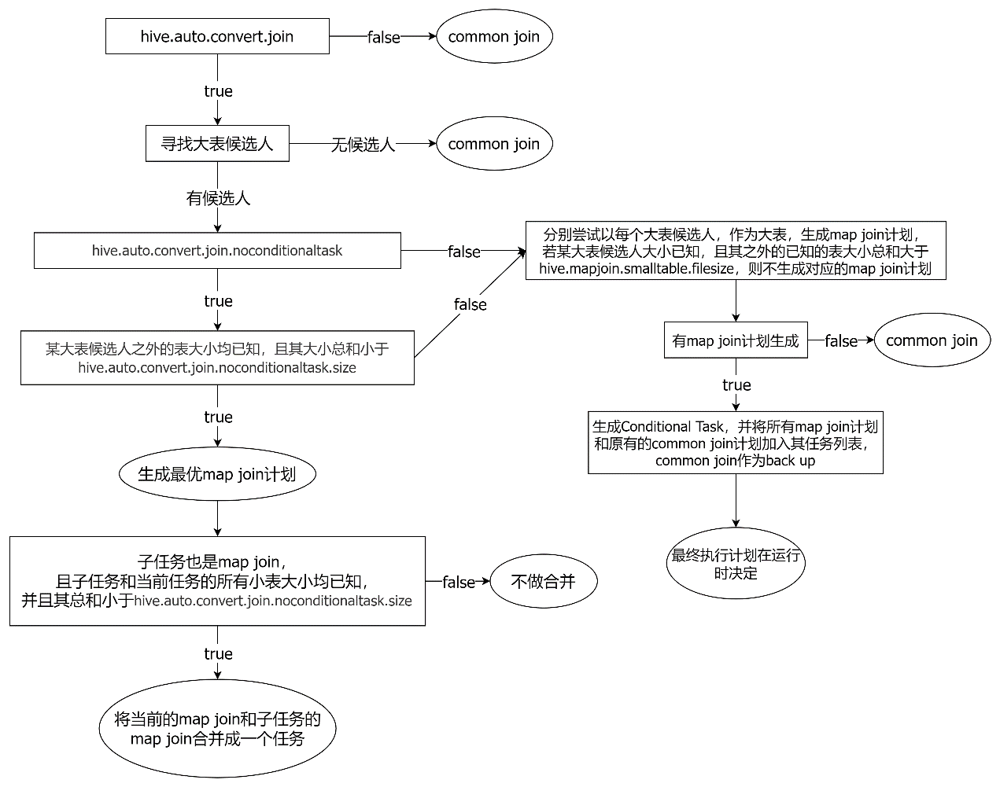

- 寻找大表候选人：依照join（不影响选大表）、left join（只能选择在左的表为大表）、full join（两张表都不能当小表）的情况下不同。
- 文件都已知且小于noconditionaltask.size（左支）：如果存在多个任务，那么会判断除去大表外他们总和是否小于预定值，是的话一起加载到缓冲区。如果小于预定值就会分多次加载成hash表，然后依次map loacl operator -> map join operator。
- 如果关闭条件任务（右支），就只能两张表依次关联，不会像上面的一次关联。如果表大于预定值，那么就会走common join。

### （2）Bucket Map Join

Bucket Map Join是对Map Join算法的改进，其打破了Map Join只适用于大表join小表的限制，可用于**大表join大表**的场景。原理就是将一张大表拆分成多张小表，让小表和大表join。

Bucket Map Join的要求：

- 参与join的表均为分桶表
- 关联字段为分桶字段，
- 其中一张表的分桶数量是另外一张表分桶数量的整数倍

### （3）Sort Merge Bucket Map Join

Sort Merge Bucket Map Join（简称SMB Map Join）基于Bucket Map Join。SMB Map Join同Bucket Join一样，同样是利用两表各分桶之间的关联关系，在分桶之间进行join操作，不同的是，分桶之间的join操作的实现原理。Bucket Map Join，两个分桶之间的join实现原理为Hash Join算法；而SMB Map Join，两个分桶之间的join实现原理为Sort Merge Join算法。

Hash Join和Sort Merge Join均为关系型数据库中常见的Join实现算法。Hash Join的原理相对简单，就是对参与join的一张表构建hash table，然后扫描另外一张表，然后进行逐行匹配。

SMB Map Join要求：

参与join的表均为分桶表，且需保证分桶内的数据是有序的，且分桶字段、排序字段和关联字段为相同字段，且其中一张表的分桶数量是另外一张表分桶数量的整数倍。

## 6.4数据倾斜优化

不同key值的数量相差太大，导致某些reduce的处理压力太大

### （1）分组聚合导致的数据倾斜

group by聚合某些key的数量太大。两种优化方式：

① 开启分组聚合优化，在Map-side侧事先聚合，如6.2（首选）

② SKew-GroupBy优化：

原理：开启一个额外的MR将要聚合的Key给打乱，然后再放到原先的MR程序中。

```mysql
--启用分组聚合数据倾斜优化
set hive.groupby.skewindata=true;
```

### （2）Join导致的数据倾斜

同样的，关联字段如果分布不均，那么会导致大量相同Key进入同一Reduce。两种优化：

① Map join，再map端就给join起来就不用进入shuff了，如6.3（首选）

② Skew join：

原理：开启一个额外的MR，在原有MR的reduce端中对每组KV实体进行阈值判断，如果比阈值大，那么就会刷洗到hdfs文件中，然后开启一个额外的MR程序来作map join

```mysql
--启用skew join优化
set hive.optimize.skewjoin=true;
--触发skew join的阈值，若某个key的行数超过该参数值，则触发
set hive.skewjoin.key=100000;
```

③ 调整MySQL的顺序

## 6.5 任务并行度

（1）Map Task并行

Map端的并行度，也就是Map的个数。是由输入文件的切片数决定的。一般情况下，Map端的并行度无需手动调整。如果小文件太多导致MapTask太多，考虑

**CombineHiveInputFormat**这个参数（同Hadoop中的combineInputformat）

（2）Reduce Task并行

Reduce端的并行度，也就是Reduce个数。相对来说，更需要关注。Reduce端的并行度，可由用户自己指定，也可由Hive自行根据该MR Job输入的文件大小进行估算。

```mysql
--指定Reduce端并行度，默认值为-1，表示用户未指定
set mapreduce.job.reduces;
--Reduce端并行度最大值
set hive.exec.reducers.max;
--单个Reduce Task计算的数据量，用于估算Reduce并行度
set hive.exec.reducers.bytes.per.reducer;
```

那么hive中Reduce端的并行度为：
$$
min⁡(ceil(\frac{total}{bytesPerReducer}),maxReducers)
$$
total：是输入文件的大小，后面被优化为Map job输出的文件的大小。

bytesPerReducer：上面的第三个参数设置的值

maxReducers：上面第二个参数设置的值。

有些情况下默认估值不准，可以按照上面的公式来计算更合理的reduce数量。

## 6.6 小文件合并

三种解决小文件问题的方法：

① 在HDFS端，手动的先将已知小文件进行打包。

② 在Map端，利用CombineHiveInputFormat进行合并。

③ 在Reduce输出端：

Reduce输出端输出的文件个数取决于Reducer的个数，可以通过设置参数将输出的小文件合并成一个。

```
--开启合并map only任务输出的小文件
set hive.merge.mapfiles=true;

--开启合并map reduce任务输出的小文件
set hive.merge.mapredfiles=true;

--合并后的文件大小
set hive.merge.size.per.task=256000000;

--触发小文件合并任务的阈值，若某计算任务输出的文件平均大小低于该值，则触发合并
set hive.merge.smallfiles.avgsize=16000000;
```

## 6.7 其他优化（了解）

（1）CBO优化（默认开启）：

基于代价的优化，hive根据不同数据的行数等开销动态来调整HQL语句的执行顺序。

（2）谓词下推（默认开启）：

将过滤操作尽可能往前执行（在不影响结果前提下），这样就会使后面操作的记录数更少。

（3）矢量化查询：

将一整列的标量数据当作一个矢量面对适量进行矢量计算。

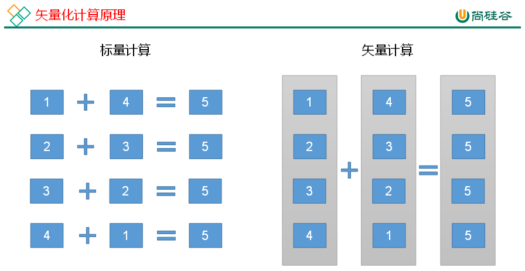

（4）并行执行：

对Hive的**stage**进行并行处理，区别于上面的基于task的并行。

```shell
--启用并行执行优化
set hive.exec.parallel=true;       
    
--同一个sql允许最大并行度，默认为8
set hive.exec.parallel.thread.number=8; 
```

（5）严选模式

当设置了参数来检测是否有危险操作，有的话就不允许执行，防止一些危险操作，如：

①分区表不适用过滤分区，会把整张大表给读出来。

```
hive.strict.checks.no.partition.filter
```

② 使用order by 没有limit过滤，会增大reduce负担。因为设置了limit之后，MR会在Map端进行条数筛选，只输出limit条记录会大大减少reduce数量。

```
hive.strict.checks.orderby.no.limit
```

③ 笛卡尔积，限制笛卡尔积

```
hive.strict.checks.orderby.no.limit
```

# 7.HQL的执行过程

## 7.1 HQL底层执行计划

在 Hive 这一侧，总共有五个组件：

**UI：**用户界面。可看作我们提交SQL语句的命令行界面。

**DRIVER：**驱动程序。接收查询的组件。该组件实现了会话句柄的概念。

**COMPILER：**编译器。负责将 SQL 转化为平台可执行的执行计划。对不同的查询块和查询表达式进行语义分析，并最终借助表和从 metastore 查找的分区元数据来生成执行计划。

**METASTORE：**元数据库。存储 Hive 中各种表和分区的所有结构信息。

**EXECUTION ENGINE：**执行引擎。负责提交 COMPILER 阶段编译好的执行计划到不同的平台上（如果下面是yarn就理解为给yarn就好了）。

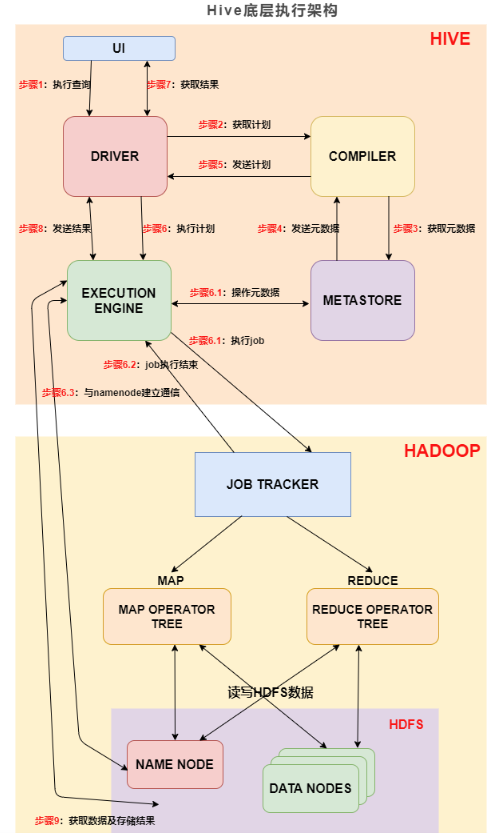


## 7.2 HQL 转化为MR的过程

编译 SQL 的任务是在上节中介绍的 COMPILER（编译器组件）中完成的。Hive将SQL转化为MapReduce任务，整个编译过程分为六个阶段：

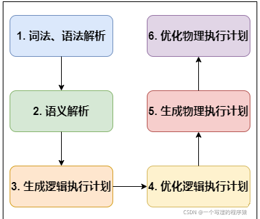

**1、词法、语法解析:** Antlr 定义 SQL 的语法规则，完成 SQL 词法，语法解析，将 SQL 转化为**抽象语法树** AST Tree；

>  **Antlr**是一种语言识别的工具，可以用来构造领域语言。使用Antlr构造特定的语言只需要编写一个语法文件，定义词法和语法替换规则即可，Antlr完成了词法分析、语法分析、语义分析、中间代码生成的过程。

**2、 语义解析:** 遍历 AST Tree，抽象出查询的基本组成单元 **QueryBlock**；

**3、 生成逻辑执行计划:** 遍历 QueryBlock，翻译为执行操作树 OperatorTree；

**4、 优化逻辑执行计划:** 逻辑层优化器进行 OperatorTree 变换，合并 Operator(如相同的select、相同的filter)，达到减少 MapReduce Job，谓词下推、矢量化减少数据传输及 shuffle 数据量；

**5、 生成物理执行计划:** 遍历 OperatorTree，翻译为 MapReduce 任务；

**6、 优化物理执行计划:** 物理层优化器进行 MapReduce 任务的变换，生成最终的执行计划。

>  原文链接：https://blog.csdn.net/qq_32727095/article/details/120512994
