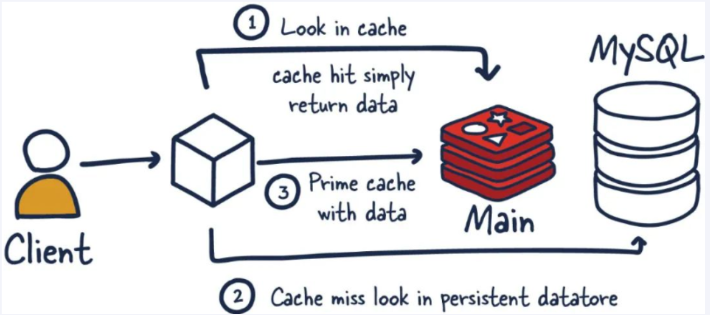
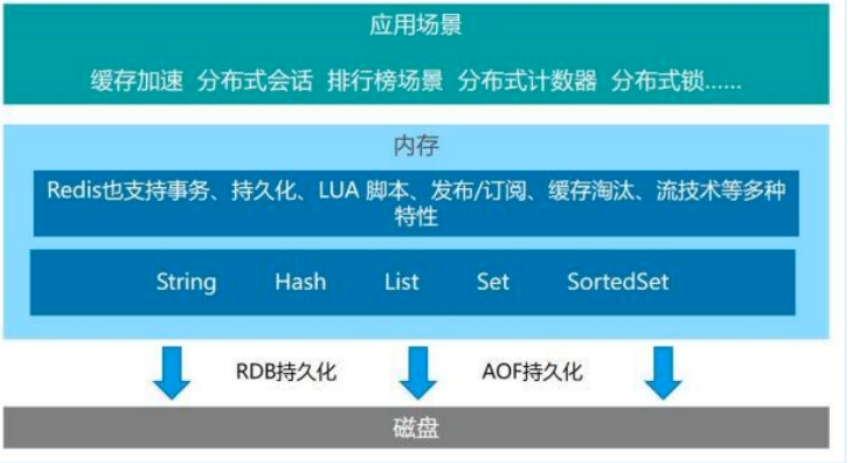
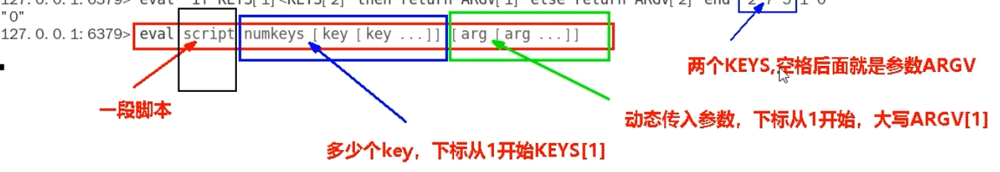
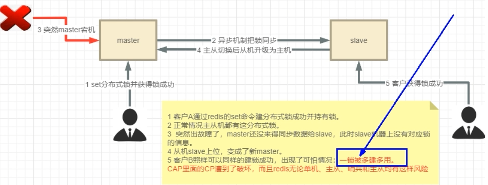
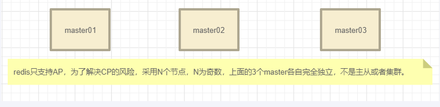

# Redis笔记

# 一.初识Redis

## （1）Redis是什么？

一种基于**内存**的**KV键值对**分布式缓存数据库。是为了减轻Mysql压力在Mysql之前部署的数据库，提升了访问性能、适用于以查询为主的数据库场景。



- 客户端查询数据会先去访问Redis，如果Redis中数据命中，那么会返回结果。
- 如果Redis中没有数据的话，客户端会去MySql中找数据。同时，Mysql会将查询数据回写进Redis。
- 这时，客户端再查询的时候，Redis就能返回数据。

## （2）Redis持久化的作用是什么

Redis是基于内存的缓存数据队列，一旦断电数据会丢失，所以是不可靠的。故需要持久化到磁盘。

## （3）分布式Redis怎么实现

需求：一台redis是不可靠的，为了满足多并发高可用场景，需要分布式。

分布式的方式实现有主从、哨兵和集群。



# Redis分布式锁

> Q：为什么要有Redis分布式锁？
>
> A：因为Java自带锁机制是基于线程的，是同个JVM进程内的线程间的锁。而实际分布式场景中是多个不同的进程，为不同进程上锁需要新的机制。

基本命令：setnx key value（线程不安全，因为需要和expire连用，不能保证原子性，且不能解决重入问题）

setnx：表示如果不存在的话创建名为key的锁。

value：通常由UUID+线程ID组成。

```java
IdUtil.simpleUUID()+Tread.currentTread().getId();
```

当然整个语句还可以写为

set key value [EX seconds] [PX milliseconds] [NX|XX]

EX表示过期使时间为秒，PX表示过期时间设置为毫秒，NX是不存在创建，XX是存在才设置。

#### 分布式锁需满足四个条件

首先，为了确保分布式锁可用，我们至少要确保锁的实现同时满足以下四个条件：

1. 互斥性。在任意时刻，只有一个客户端能持有锁。
2. 不会发生死锁。即使有一个客户端在持有锁的期间崩溃而没有主动解锁，也能保证后续其他客户端能加锁。
3. 解铃还须系铃人。加锁和解锁必须是同一个客户端，客户端自己不能把别人加的锁给解了，即不能误解锁。
4. 具有容错性。只要大多数Redis节点正常运行，客户端就能够获取和释放锁。

#### Lua脚本实现操作的原子性

在Redis中的使用：



```lua
eval "if redis.call('get',KEYS[1])==ARGV[1] then return redis.call('del',KEYS[1]) else return 0 end" 1 zzyyRedisLock 1111-2222-3333
```

eval:是唤醒词；redis.call是告诉Redis括号中的方法可以由erdeis解析。后面的参数依次表示数量、key和参数

需要注意的一点是！！外面已经使用了双引号，故里面的方法只能使用单引号。

在java中的使用：

```Java
// 参数说明： new DefaultRedisScript<>(script,Long.class) arg[1]：lua脚本语句;  arg[2]: lua脚本返回数据类型
//	Arrays.asList(key)：锁名
//  value：uuid:线程id
stringRedisTemplate.execute(new DefaultRedisScript<>(script,Long.class), Arrays.asList(key),value); //使用该构造方法，不然报错
```

#### 怎么实现独占性和防死锁（没有拿到锁的怎么办？）

思想：通过while判断，如果当前的锁存在或者当前锁的key和自己的不一样那么就会休眠线程，直到拿到锁。否则就会创建锁或者重入锁。为了满足原子性下面采用lua脚本的方式来实现。

```java
// lua脚本， KEYS[1]：锁名;   ARGV[1]：uuid:线程id;	ARGV[2]:毫秒;
// exists是查询key是否存在；hexists是利用hash表来查询key是否存在；这两个方法存在都为1
// hincrby在hash表中为(key, value)字段加上指定增量值。就是来记录可重入数量。如果没有hash表就创建一个hash表
// expire是在指定毫秒后释放锁；
String script =
    "if redis.call('exists',KEYS[1]) == 0 or redis.call('hexists',KEYS[1],ARGV[1]) == 1 then " +
    	"redis.call('hincrby',KEYS[1],ARGV[1],1) " +
    	"redis.call('expire',KEYS[1],ARGV[2]) " +
    	"return 1 " +
    "else " +
    	"return 0 " +
    "end";       
// 创建锁的同时，申明释放时间具有原子性。
while (!stringRedisTemplate.execute(new DefaultRedisScript<>(script,Boolean.class), 		                         Arrays.asList(lockName),uuidValue,String.valueOf(expireTime))) {
            // 休眠50毫秒
            TimeUnit.MILLISECONDS.sleep(50);
        }
```

> Q1:	exists和hexists之间有什么区别？
>
> A：
>
> - `exists`检查的是整个key是否存在，用于判断是否可以创建一个新的锁。
> - `hexists`检查的是key对应的哈希表中是否存value(即uuid+threadId唯一标识)，用于判断当前请求者是否已经持有锁，从而实现可重入性。
>
> Q2:	还有一个方法叫hset，用来替代setnx，这两个方法间有什么关系?为什么实际代码里又没有体现？
>
> A：`HSET`用于设置哈希表的字段值。如果字段已经存在，`HSET`会更新字段的值；如果字段不存在，`HSET`会创建新的字段。相较于setnx，最大的区别在于hash表能够基于value来进行重入次数的计算。代码中用hincrby来体现，底层会创建一个hset。

#### 解决删除锁的原子性和防误删其他锁？

> Q：为什么可能出现误删操作？
>
> A：假设某个进程A设置了30秒释放锁，但是本次业务实际执行超过了30s。导致进程A的锁被释放，进程B拿到锁。但是当A执行完业务时会以为自己没有删锁，故把B的锁也删了。

思想：删除用lua脚本中的del实现，防误删就判断一下当前锁是否与自己的uuid相同，如果不同返回空，相同可重入-1，当减到0时删除key。

```java
String script =
                "if redis.call('HEXISTS',KEYS[1],ARGV[1]) == 0 then " +
                "   return nil " +
                "elseif redis.call('HINCRBY',KEYS[1],ARGV[1],-1) == 0 then " +
                "   return redis.call('del',KEYS[1]) " +
                "else " +
                "   return 0 " +
                "end";
        // nil = false 1 = true 0 = false
        System.out.println("lockName: "+lockName);
        System.out.println("uuidValue: "+uuidValue);
        System.out.println("expireTime: "+expireTime);
        Long flag = stringRedisTemplate.execute(new DefaultRedisScript<>(script, Long.class), Arrays.asList(lockName),uuidValue,String.valueOf(expireTime));
        if(flag == null)
        {
            throw new RuntimeException("This lock doesn't EXIST");
        }
```

#### 可重入锁

可重入锁又名递归锁是指在同一个线程在外层方法获取锁的时候，再进入该线程的内层方法会自动获取锁(前提，锁对象得是同一个对象)，不会因为之前已经获取过还没释放而阻塞。

思想：可以通过继承Lock的方式，重写自定义锁。可重入的思想就是每次调用锁记录次数，解锁减去次数，为0时就可以删锁。如下：

1.判断是否存在锁（exist）

2.如果有判断是否是自己的锁（hexist）

3.每次可重入+1（hincrby）

4.结束重入-1

5.判断为0在删锁

```lua
-- 加锁
if redis.call('exists',KEYS[1]) == 0 or redis.call('hexists',KEYS[1],ARGV[1]) == 1 then 

  redis.call('hincrby',KEYS[1],ARGV[1],1) 

  redis.call('expire',KEYS[1],ARGV[2]) 

  return 1 

else

  return 0

end

-- 解锁
if redis.call('HEXISTS',KEYS[1],ARGV[1]) == 0 then

 return nil

elseif redis.call('HINCRBY',KEYS[1],ARGV[1],-1) == 0 then

 return redis.call('del',KEYS[1])

else

 return 0

end
```

java代码：

```java
import cn.hutool.core.util.IdUtil;
import org.springframework.beans.factory.annotation.Autowired;
import org.springframework.data.redis.core.StringRedisTemplate;
import org.springframework.data.redis.core.script.DefaultRedisScript;
import org.springframework.data.redis.support.collections.DefaultRedisList;
import org.springframework.stereotype.Component;

import java.util.Arrays;
import java.util.concurrent.TimeUnit;
import java.util.concurrent.locks.Condition;
import java.util.concurrent.locks.Lock;

/**
 * @auther zzyy
 * @create 2022-10-18 18:32
 */
//@Component 引入DistributedLockFactory工厂模式，从工厂获得而不再从spring拿到
public class RedisDistributedLock implements Lock
{
    private StringRedisTemplate stringRedisTemplate;

    private String lockName;//KEYS[1]
    private String uuidValue;//ARGV[1]
    private long   expireTime;//ARGV[2]
    public RedisDistributedLock(StringRedisTemplate stringRedisTemplate, String lockName)
    {
        this.stringRedisTemplate = stringRedisTemplate;
        this.lockName = lockName;
        this.uuidValue = IdUtil.simpleUUID()+":"+Thread.currentThread().getId();//UUID:ThreadID
        this.expireTime = 30L;
    }
    @Override
    public void lock()
    {
        tryLock();
    }
    @Override
    public boolean tryLock()
    {
        try {tryLock(-1L,TimeUnit.SECONDS);} catch (InterruptedException e) {e.printStackTrace();}
        return false;
    }

    /**
     * 干活的，实现加锁功能，实现这一个干活的就OK，全盘通用
     * @param time
     * @param unit
     * @return
     * @throws InterruptedException
     */
    @Override
    public boolean tryLock(long time, TimeUnit unit) throws InterruptedException{
        if(time != -1L){
            this.expireTime = unit.toSeconds(time);
        }
        String script =
                "if redis.call('exists',KEYS[1]) == 0 or redis.call('hexists',KEYS[1],ARGV[1]) == 1 then " +
                        "redis.call('hincrby',KEYS[1],ARGV[1],1) " +
                        "redis.call('expire',KEYS[1],ARGV[2]) " +
                        "return 1 " +
                "else " +
                        "return 0 " +
                "end";

        System.out.println("script: "+script);
        System.out.println("lockName: "+lockName);
        System.out.println("uuidValue: "+uuidValue);
        System.out.println("expireTime: "+expireTime);

        while (!stringRedisTemplate.execute(new DefaultRedisScript<>(script,Boolean.class), Arrays.asList(lockName),uuidValue,String.valueOf(expireTime))) {
            TimeUnit.MILLISECONDS.sleep(50);
        }
        return true;
    }

    /**
     *干活的，实现解锁功能
     */
    @Override
    public void unlock()
    {
        String script =
                "if redis.call('HEXISTS',KEYS[1],ARGV[1]) == 0 then " +
                "   return nil " +
                "elseif redis.call('HINCRBY',KEYS[1],ARGV[1],-1) == 0 then " +
                "   return redis.call('del',KEYS[1]) " +
                "else " +
                "   return 0 " +
                "end";
        // nil = false 1 = true 0 = false
        System.out.println("lockName: "+lockName);
        System.out.println("uuidValue: "+uuidValue);
        System.out.println("expireTime: "+expireTime);
        Long flag = stringRedisTemplate.execute(new DefaultRedisScript<>(script, Long.class), Arrays.asList(lockName),uuidValue,String.valueOf(expireTime));
        if(flag == null)
        {
            throw new RuntimeException("This lock doesn't EXIST");
        }

    }

    //===下面的redis分布式锁暂时用不到=======================================
    //===下面的redis分布式锁暂时用不到=======================================
    //===下面的redis分布式锁暂时用不到=======================================
    @Override
    public void lockInterruptibly() throws InterruptedException
    {

    }

    @Override
    public Condition newCondition()
    {
        return null;
    }
}
```

#### 自动续期

> 场景：某个业务在释放锁的时间内不能完成，需要加钟。

```lua
--自动续期
if redis.call('HEXISTS',KEYS[1],ARGV[1]) == 1 then
  return redis.call('expire',KEYS[1],ARGV[2])
else
  return 0
end
```

```java
    private void renewExpire()
    {
        String script =
                "if redis.call('HEXISTS',KEYS[1],ARGV[1]) == 1 then " +
                        "return redis.call('expire',KEYS[1],ARGV[2]) " +
                        "else " +
                        "return 0 " +
                        "end";
		// 起了一个时间调度器，每隔几秒检查当前获得时间是否到达this.expireTime * 1000)/3条件
        new Timer().schedule(new TimerTask()
        {
            @Override
            public void run()
            {
                if (stringRedisTemplate.execute(new DefaultRedisScript<>(script, Boolean.class), Arrays.asList(lockName),uuidValue,String.valueOf(expireTime))) {
                    // 继续开通自动续期服务，直到完成业务
                    renewExpire();
                }
            }
        },(this.expireTime * 1000)/3);
    }
```

#### RedLock

> Q：自研分布式锁的缺陷？
>
> A：缺乏对Redis分布式锁的管理。一旦某个单点锁挂了，难以实现安全性。如下面场景。



RedLock能够实现高容错和高可用，通过Redis集群来实现。不同的是，**这个集群里每个Redis都是master！**

整个集群中存在节点N = 2X + 1（X是容错节点数量，可以down的数量）



> Q：为什么是奇数？
> A：保证容错，且奇数比偶数用的更少一台。
>
>  加入在集群环境中，redis失败1台，可接受。2X+1 = 2 * 1+1 =3，部署3台，死了1个剩下2个可以正常工作，那就部署3台。
>
>  加入在集群环境中，redis失败2台，可接受。2X+1 = 2 * 2+1 =5，部署5台，死了2个剩下3个可以正常工作，那就部署5台。

**单机实现（单把锁）：**

```java
   //单Redis节点模式
    @Bean
public Redisson redisson()
    {
        Config config = new Config();
    	config.useSingleServer().setAddress("redis://192.168.111.175:6379")
                              .setDatabase(0).setPassword("111111");
        return (Redisson) Redisson.create(config);
    }
private Redisson redisson;
public String saleByRedisson()
    {
        String retMessage = "";
        String key = "zzyyRedisLock";
        RLock redissonLock = redisson.getLock(key);
        redissonLock.lock();
        try
        {
			// 业务
        }finally {
          redissonLock.unlock();
        }
        return retMessage+"\t"+"服务端口号："+port;
    }
```

> Q：超高并发下Kennedy共存在，锁误删的问题。java.lang.IllegalMonitors Create breakpoint : attempt to unlock lock, not locked by current threac by node id:8fead322-0786-4122-be84-1551b80a704a thread-id:105
>
> A：原因是解锁的时候应该判断当前是否存在锁且该锁是自己。不用考虑原子性，底层做过封装了。如下：

```java
if(redissonLock.isLocked() && redissonLock.isHeldByCurrentThread())
{
    redissonLock.unlock();
}
```

**多机(Redis锁)实现：**

> Q：怎么理解分布式多重锁
>
> A：支持多把锁，相当于由多把锁充当一把锁，即使允许容错锁掉。

Redis的Redisson在处理多重锁已经弃用，需要用MultiLock多重锁，以下是示例：

```java
public class RedLockController {

    public static final String CACHE_KEY_REDLOCK = "ATGUIGU_REDLOCK";

    @Autowired
    RedissonClient redissonClient1;

    @Autowired
    RedissonClient redissonClient2;

    @Autowired
    RedissonClient redissonClient3;

    boolean isLockBoolean;

    @GetMapping(value = "/multiLock")
    public String getMultiLock() throws InterruptedException
    {
        String uuid =  IdUtil.simpleUUID();
        String uuidValue = uuid+":"+Thread.currentThread().getId();

        RLock lock1 = redissonClient1.getLock(CACHE_KEY_REDLOCK);
        RLock lock2 = redissonClient2.getLock(CACHE_KEY_REDLOCK);
        RLock lock3 = redissonClient3.getLock(CACHE_KEY_REDLOCK);

        RedissonMultiLock redLock = new RedissonMultiLock(lock1, lock2, lock3);
        redLock.lock();
        try
        {
            System.out.println(uuidValue+"\t"+"---come in biz multiLock");
            try { TimeUnit.SECONDS.sleep(30); } catch (InterruptedException e) { e.printStackTrace(); }
            System.out.println(uuidValue+"\t"+"---task is over multiLock");
        } catch (Exception e) {
            e.printStackTrace();
            log.error("multiLock exception ",e);
        } finally {
            redLock.unlock();
            log.info("释放分布式锁成功key:{}", CACHE_KEY_REDLOCK);
        }

        return "multiLock task is over  "+uuidValue;
    }

}
```

即使在实施过程中某台机子坏了，坏的机子也能恢复。
