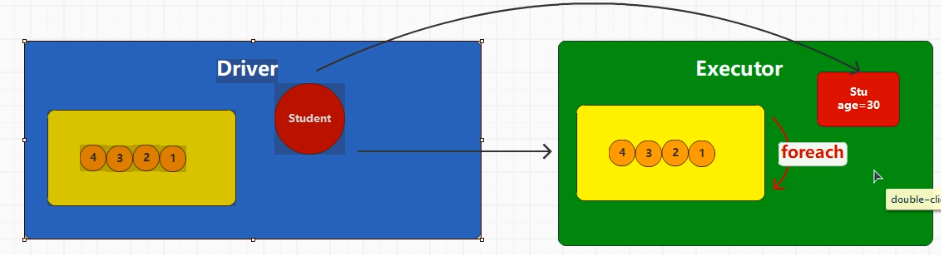
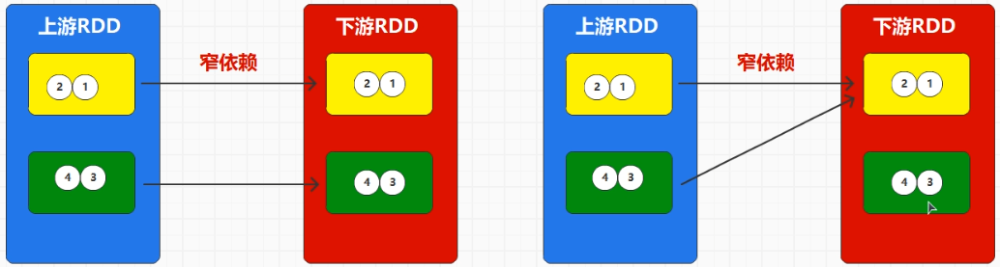
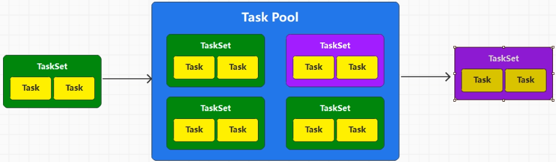

# 一、Spark入门

Q1：为什么函数式语言更适合处理大数据。

​	a.大数据更关心的是怎么对数据来处理，而不是处理的是什么数据（对象）

​	b.在面向对象的java中，有“方法”，但是方法是来描述类的行为，不具有普适性。不能给所有不同数据作操作。而且为了一个函数，还需要牺牲内存去多创建一个类么？


​	但是Hadoop的劣势：不能迭代式的计算。


## 1.1部署方式：

spark core：

​		spark环境：javaSparkContext。  数据模型：javaRDD 

<u>**单机模式和集群模式**。资源由谁来提供。</u>

### （1）单机：由单一节点来提供资源。


进程上起一个sparksubmit进程向本地资源请求资源。

```
（在spark的根目录下执行）bin/spark-submit \
--class org.apache.spark.examples.SparkPi \
--master local[2] \
./examples/jars/spark-examples_2.12-3.3.1.jar \
1000
```

### （2）集群模式：

<u>由多个节点来提供。如果资源是由yarn来提供的，那么又叫**yarn部署环境**。</u>

Q1：关于yarn中的资源分出多少给spark用？

A：由NM中起两个进程Driver和Executor来决定分配给spark多少资源。具体地进程名为**sparksubmit、Executorlaucher和Excutor**。

Q2：spark向yarn申请资源时是基于scala的，但是yarn上没有scala环境，那么该怎么运行呢？

A：在sparksubmit前会先将依赖传到hdfs中，然后等spark运行结束后删除这些依赖。


配置两个地方：

```java
// 1. 配置yarn-site.xml
vim yarn-site.xml
<!--是否启动一个线程检查每个任务正使用的物理内存量，如果任务超出分配值，则直接将其杀掉，默认是true -->
<property>
     <name>yarn.nodemanager.pmem-check-enabled</name>
     <value>false</value>
</property>

<!--是否启动一个线程检查每个任务正使用的虚拟内存量，如果任务超出分配值，则直接将其杀掉，默认是true -->
<property>
     <name>yarn.nodemanager.vmem-check-enabled</name>
     <value>false</value>
</property>

// 2. 在spark中配置spark环境
mv spark-env.sh.template spark-env.sh
[atguigu@hadoop102 conf]$ vim spark-env.sh

YARN_CONF_DIR=/opt/module/hadoop/etc/hadoop
```

### （3）spark on yarn有client和cluster两种模式

两者的区别在于Driver所在的位置不同，当然在具体环境下的叫法又不一样。

- Client把Driver进程叫做ExecutorLaunchr，放在JVM端。
- Cluster把Driver放在NM上叫做AppMaster。


# 二、RDD

Q1：什么是RDD？

A：RDD（弹性分布式数据集）。把他看作是一种分布式计算模型就好，里面封装了大量的方法和属性。主要实现**数据的切分**和**计算逻辑**。类比字符串String类，有大量的方法。**Task的数量和数据切片的数量是一致的 。**


Q2：RDD和字符串之间的区别：

A：字符串 的方法是立即执行的，但是RDD的需要大量的RDD对象组合在一起实现复杂的功能，且大量的功能叠加后再执行。


Q3：RDD的处理方式和java 流完全一样，采用装饰者设计（套娃）模式一样。

```
回顾复习IO流：
Q：什么是字节流和字符流？
A：字节流是用来处理每个字节的，但是现实场景中往往需要多个字节表示一个字符（如汉字）。但是，者并不意味着字节流处理的数据就小！字节流通常用来处理图片、视频和语音等，而字符流更适合处理文本数据。
Q：IO流的常用类有哪些？
A：文件字节流：FileInputStream、FileOutputStream，BufferedInputStream、Buffered。通常用(in = fs.read())!=-1来判断读，也会用字符数组(len=fs.read(cuf))!= -1。文件字符流：FileReader、FileWriter、BufferedReader、BufferedWriter。
Q：字节流和字符流都能输出，为什么需要转换流？
A：字节流不能直接转成字符流，而是通过转换流。转换流主要处理字符编码问题，计算机内部处理数据通常是以字节的形式，但人类阅读和书写的是字符。这两者之间的转换需要考虑字符编码。InputStramReader和OutputWriter 
```


## 2.1创建RDD

```java
        SparkConf conf = new SparkConf();
        conf.setMaster("local");
        conf.setAppName("Spark");

//        创建Spark配置对象
        final JavaSparkContext jsc = new JavaSparkContext(conf);

        jsc.close();
```

常用方法：

textFile、parallelize、saveasTextFile


## 2.2分区规则

（1）（内存）从集合中创建RDD

```java
        SparkConf conf = new SparkConf();
        conf.setMaster("local");
        conf.setAppName("spark");
        JavaSparkContext jsc = new JavaSparkContext(conf);
        List<String> data = Arrays.asList("BeiJing", "Lundon", "ShaoXing");

        JavaRDD<String> rdd = jsc.parallelize(data, 3);
        List<String> collect = rdd.collect();
        collect.forEach(System.out::println);
        rdd.saveAsTextFile("output");

        jsc.stop();
```

**分区的数量：**Spark在读取集合数据时，分区设定存在3种不同场合

- 1.优先使用方法参数 parallelize（“”，num）
- 2.使用配置参数:spark.default.parallelism
- 3.采用环境默认核数值

**数据被切分放到哪个分区的规则**：

length：表示数据的个数索引。

n(分区索引)：[start, end) => ((i * length)/ numPartitions, ((i+1) * length) / numPartitions))

**（2）（外存）文件数据源分区设定：**

**1.分区数量：**

如果在使用方法参数 parallelize中规定了numSlices则取numSlices。 默认填写的最小分区数2和环境的核数取小的值 一般为2，也即后面的numSlices。

```java
    JavaRDD<String> lineRDD = sc.textFile("input/1.txt");
    lineRDD.saveAsTextFile("output");
```

 具体的分区个数需要经过公式计算：

 首先获取文件的总长度 totalSize，计算平均长度 goalSize = totalSize / numSlices，获取块大小 128M， 计算切分大小 

​	splitSize = Math.max(minSize, Math.min(goalSize, blockSize));

​	numPartitions = totalSize // splitSize + 1(这个余数加不加1取决于余数是否超过分区数量的10%) 

最后使用splitSize 按照1.1倍原则切分整个文件  得到几个分区就是几个分区。 实际开发中  <u>只需要看文件总大小 / 填写的分区数 和块大小</u>比较 谁小拿谁进行切分

**2.数据被切分放到哪个分区的规则**：

已知分区数量splitSize。

如果一行（包括换行符）少于splitSize，那么下一行同这一行存一个文件。因为一次读一行，读了要存完。

如果一行多余splitSize，那么输出这行就行。然后下个分区就从多出的splitSize中扣掉。

如：字段“Bei”、“LundonJing”、“ShaoXing”。分三个取，字节总数向（含两个换行字符）。

那么分区数量为：spliteSize = 25/3 =8， numPartitions = 25/8 +1 =4

分区0存：Bei LundonJing（因为分区1读8位读到了第二行，所以要整行输出）；分区1存：ShaoXing（接着位序读）；分区23空着。


## 2.3 RDD方法

方法分类的话有两大类方法：转换算子（RDD下游，数据在RDD间的转换）和行动算子。

处理数据分类：单值；键值对


### 2.3.1 转换算子

（一）Map（类型转换和数值映射  ）：

```java
        // 1.Map能对数据进行类型转换，如将List<String> -> List<Integer>
		JavaSparkContext jsc = new JavaSparkContext(conf);
        jsc
                .parallelize(list, 2)
                .map(num -> Integer.parseInt(num))
        // 2.Map对数据进行函数映射
            	.map(num -> num * 2)
```

**2.分区间的顺序关系**：**分区间有序，分布间无序**


其实RDD的调用，底层其实是装饰者模式，所以从这个角度来理解RDD间的分区数量是一致，且分区索引一一对应。


**3.执行流程：**每一个数据执行完所有的RDD再走下一个数据


（二）Filter（怎么解决？改过滤规则？合并散数据？）：

```java
    // 保留lambda表达式中判断为true的数据    
	jsc
                .parallelize(list, 2)
                .map(num -> Integer.parseInt(num))
                .filter(num -> num % 2 == 0)
```

可能会出现资源倾斜的问题：


**Q：怎么解决数据倾斜的问题：**

A：思路就是增加分区或者说是重新分区。有方法可以做到重新分区：

coalesce（intpartitions，boolean shuffle）。原理是利用shuffle对数据重新分区或者扩容分区。可以扩容也可以缩容 

repartition（inpartition），重新分区，就是coalesce的shuffle为true的方法。

（三）FlatMap：

展平+Map

```java
         jsc
                .parallelize(list, 2)
                .flatMap(strings -> strings.iterator())
                .collect()
                .forEach(System.out::println);
```

（四）Group by

```java
         jsc
                .parallelize(list, 2)
                .flatMap(strings -> strings.iterator())
                 .map(string -> Integer.parseInt(string))
                .groupBy(num -> num % 2)
                .collect()
                .forEach(System.out::println);
```

**(五)  shuffle**

原先在RDD间是分区间一一对应的，但是shuffle的出现，RDD间的数据重新分区，一个分区允许出现不同组，**shuffle一定会落盘。**


对于shuffle来说，分为**shuffle读和写**的两个过程。shuffle写是将数据落入到磁盘中进行分区（为什么落到内存呢？），shuffle读是将数据取出来。那么**写线程数量和RDD的分区数一致，读线程和groupby分区数一致。**

Q1：如果GroupBy前的分区数和shuffle的分区的数量不一致怎么办？

A：听shuffle的。所以有可能出现shuffle的分区过多，导致磁盘空间浪费。

Q1：为什么一定会落盘？这些不是会增加IO和降低效率吗？

A：因为RDD没有保存数据的能力，一定要全部groupby才能往下走（为什么），所以只能先存到磁盘里。

Q2：为什么需要Shuffle

因为一个分区对应一个execute，但是因为分区数和groupby数量不同可能导致多的分区数。所以shuffle操作都可以更改分区的操作，如。

```java
jsc
	.parallelize(list, 2)
	.flatMap(strings -> strings.iterator())
	.map(string -> Integer.parseInt(string))
	.groupBy(num -> num % 2, 2 )
```

（六）distinct（分布式去重）

Q1：怎么实现分布式去重？

A：广义上是将所有的数据进行内部去重，底层上是利用了分组和shuffle。通过将相同的元素分到同一个组内，在组用hashset来去重。

```JAVA
        jsc
                .parallelize(list, 3)
                .map(string -> Integer.parseInt(string))
                .distinct(2)
                .collect()
                .forEach(System.out::println);
        jsc.close();
```

（七）sortBy

**原理**：底层是shuffle，对所有分区内的数据进行排序。通过shuffle操作会对数据进行打乱分区的重排序。

Q：里面的function该怎么定义，排序的规则是什么？

A：现在函数就认为是num -> num就行了。如果要排序的是字符串，则是按照第一位的字典顺序。

```java
        jsc
                .parallelize(list, 3)
                .map(string -> Integer.parseInt(string))
                .sortBy(num -> num, true, 2)
                .collect()
                .forEach(System.out::println);
        jsc.close();
```

（八）KV 类

parallelizePairs（KV并行处理）、mapValues（只对每个元组的v值进行操作返回的还是元组类型）、mapToPairs（创建元组）方法

```java
//        元组数据
        Tuple2<String, Integer> kv1 = new Tuple2<>("Shan", 24);
        Tuple2<String, Integer> kv2 = new Tuple2<>("Qi", 20);
        Tuple2<String, Integer> kv3 = new Tuple2<>("Sinkear", 24);

        List<Tuple2<String, Integer>> list = Arrays.asList(kv1, kv2, kv3);

//		  一般地，会用kv来操作。但是在大数据中还是直接传值操作更明确一点
//        jsc.parallelize(list, 2)
//                .map(kv -> kv._2 * 2)
//                .collect()
//                .forEach(System.out::println);

        final JavaPairRDD<String, Integer> pairRDD =  jsc.parallelizePairs(list);
        pairRDD
            .mapValues(num -> num * 2)
            .collect()
            .forEach(System.out::println);

        jsc.parallelize(nums, 2)
                        .mapToPair(num -> new Tuple2<>(num+"", num))
                                .collect().forEach(System.out::println);
```

sortByKey，wordcount案例：

如果排序的是一个类的话，要求类实现了**Serializable**和**Comparable**接口。

```java
        JavaRDD<String> lines = jsc.textFile("data/cities.txt");
        lines.flatMap(strings -> Arrays.asList(strings.split(" ")).iterator())
                .groupBy(str -> str)
                .mapValues(words -> {
                    int sum = 0;
                    for (String word : words) {
                        sum += 1;
                    }
                    return sum;
                }).sortByKey()
        .collect().forEach(System.out::println);
```

groupByKey与groupBy的区别：

```java
同样对数据进行分组，
    groupBy是[String， iterator<tuple<String, Integer>>]
    而groupByKey是[String, Integer]
```

（九）reduceByKey

shuffle+groupby+计算。**对相同key的value进行操作，而不是对key进行操作！！！**

```java
        SparkConf conf = new SparkConf().setMaster("local").setAppName("spark");

        JavaSparkContext jsc = new JavaSparkContext(conf);

        Tuple2<String, Integer> n1 = new Tuple2<>("a", 1);
        Tuple2<String, Integer> n2 = new Tuple2<>("c", 2);
        Tuple2<String, Integer> n3 = new Tuple2<>("c", 3);
        Tuple2<String, Integer> n4 = new Tuple2<>("a", 4);
        List<Tuple2<String, Integer>> list = Arrays.asList(n1, n2, n3, n4);

        JavaPairRDD<String, Integer> pairRDD = (JavaPairRDD<String, Integer>) jsc.parallelizePairs(list);
        JavaPairRDD<String, Integer> wordCount = pairRDD.reduceByKey(Integer::sum);
        wordCount.collect().forEach(System.out::println);
```

Q ：优化shuffle

A：换读取效率更快的磁盘（花钱）；增加磁盘读写缓冲区；不影响最终结果，那么磁盘读写的数据越少，性能越高。即**在shuffle之前使得数据量更少。**

Q：那么怎么实现预聚合呢？

A：reduceByKey会在shuffle前进行进行**预聚合Combine**，从而减少shuffle数量。所以**优先使用reducebykey。**


### 2.3.2 行动算子

作用：触发作业的执行。如果相当与程序开关，如果没有行动算子，那么上面所有的RDD操作都不会跑起来(看后面其实是跑了的，只不过所有的spark计算都是在Executor上执行的，但是没有被collect拉回来)。

区分行动和转换算子：就看方法的返回值是不是RDD类型，是的话就是转换，不是就是行动。一般行动算子都能让代码跑出来。有一个特例sortBy，它是转换算子但是也能让代码跑起来，原因在于，sortBy底层封装了一个collect方法。

（一）collect

collect方法就是将Executor端执行的结果按照分区的顺序**拉取(采集)回到**Driver端，将结果组成和集合对象。


**RDD的所有操作定义都是在Driver端封装的，但是执行都是在Executor上，并由collect拉回来。**

Q：如果读取的数据是内容很大的外存文件呢？

A：数据不会被读入Driver，而是将文件以路径+切片的形式封装，再传给Executor。后者要用了再去对应路径里找文件。

Q：怎么区分转换算子和行动算子？

A：看返回值是一个具体的值还是RDD。如果是RDD就是行动算子，否则转换算子。

（二）其他方法

**count：**获取返回结果的数量。   **first：**获取返回结果的第一个。**take：**从结果中获取前N个

**countByKey：**对象是元组对，将结果按照计算相同Key的数量。

**saveAsText：**保存文本文件；                          **saveAsObjectFile：**将对象序列化保存成文件。

**foreach**：注意一点这是分布式循环，分布内有序，分区间无序。        **foreachPartition**（更快一些，但是有内存限制）

**reduce：**两两求和返回值。

### 2.3.3 序列化

Q：为什么需要序列化？

A：当我们在Driver端创建了一个对象，并封装到了RDD中，但是在计算时需要在Executor上执行，这个时候需要将Driver中的对象传递给Executor上。



下面代码报错的原因就是因为System.out创建对象传到Executor上发生的序列化问题。

```java
        JavaRDD<Integer> paraRDD = jsc.parallelize(list, 2);
//        Caused by: java.io.NotSerializableException: java.io.PrintStream
        paraRDD.foreach(System.out::println);
```

在Spark底层封装了一种Kryo的序列化，比java的序列化更加的高效，序列化后的体积缩小了十倍。需要用的话需要再额外设置一下，默认用的是java的序列化。

### 2.3.4 实战案例

开发原则：

1.在处理海量的数据前，先对数据进行过滤，将不要的信息给剔除

2.缺什么补什么，从原数据中找到需要的品类和行为类型。

3.功能实现中，要尽可能减少使用shuffle操作。shuffle越多，性能越低。

TOP10商品的案例：要求从文件中读入数据，对数据经过过滤后，按照每个商品的点击、下单和支付数量进行排序。

```java
//        1. 过滤不必要的字段 ,这里为什么不用paralize？
        JavaRDD<String> filterRDD = lines.filter(line -> {
            String[] words = line.split("_");
            return "null".equals(words[5]);
        });
//        2. 处理数据，保留主要字段
        JavaRDD<Tuple2<String, cateGory>> splitRDD = filterRDD.flatMap(line -> {
            Tuple2<String, cateGory> t;
            String[] words = line.split("_");
            if (!"-1".equals(words[6])) {
                cateGory c = new cateGory(words[6], 1l, 0l, 0l);
                t = new Tuple2<String, cateGory>(words[6], c);
                return Arrays.asList(t).iterator();
            } else if (!"null".equals(words[8])) {
                String[] splits = words[8].split(",");
                List<Tuple2<String, cateGory>> list = new ArrayList<>();
                for (String s : splits) {
                    cateGory c = new cateGory(words[8], 0l, 1l, 0l);
                    t = new Tuple2<String, cateGory>(words[8], c);
                    list.add(t);
                }
                return list.iterator();
            } else {
                String[] splits = words[8].split(",");
                List<Tuple2<String, cateGory>> list = new ArrayList<>();
                for (String s : splits) {
                    cateGory c = new cateGory(words[10], 0l, 0l, 1l);
                    t = new Tuple2<String, cateGory>(words[10], c);
                    list.add(t);
                }
                return list.iterator();
            }
        });

//        3. 筛选出前十
        splitRDD
                .mapToPair(kv -> kv)
                .reduceByKey(cateGory::sum)
                .map(kv -> kv._2)
                .sortBy(obj -> obj, false, 2)
                .take(10).forEach(System.out::println);
        jsc.close();
```

Q：做题的时候，想到什么时候需要用parallelize？

A：parallelize是将数据转换为并行计算的RDD，但是不是一定要用的。通常对于小数据可以使用它，但是像文本就不会用它。使用textFIle即可，和它是同一级的，功能也是转换为并行式的RDD。

Q：如果使用的是yarn，那么textFile的这个文件路径该写什么？

A：写的是HDFS的路径。

## 2.4 RDD的依赖关系

Q：什么是依赖关系？为什么要有依赖关系？

A：是RDD间（转换算子）的关系，相邻的关系叫依赖和流转，先前的叫血缘关系。因为RDD不存储数据，所以一旦最后一步没有成功存入，那么数据就会丢掉。如果有了依赖关系，那么就可以追溯数据源和操作，重现操作。


**（一）RDD有两种依赖关系：*窄依赖*和*宽依赖*。**

**窄依赖（OneToOneDependency）：**如果计算中上游的RDD的一个分区被下游RDD的**一个**分区所独享。



**宽依赖（ShuffleDependency）：**如果计算中上游的RDD的一个分区被下游RDD的**多个**分区所独享。


**（二）作业（Job）、阶段（Stage）和任务（Task）**

**Job：**Spark中的Job是由一系列的RDD操作组成，当用户执行一个Action操作时，Spark会创建一个Job。一个Job可以包含一个或多个Stage。job的数量取决于行动算子的数量。

**Stage：**一个Job根据RDD的宽窄依赖关系被划分为一个或多个Stage。每个Stage都包含了一组相同的Task，这些Task会并行地在集群上执行。每个Stage的开始是以shuffle为标志的，shuffle之前的RDD为一个Stage，shuffle之后的RDD为另一个Stage。

**Task：**Task是Spark中最小的计算单元，每个Task负责处理RDD中的一个partition。所以**Task的数量是每个阶段最后一个RDD的分区数之和**，一个Stage包含多个Task，这些Task会并行执行。（如果想不通数量就想想装饰者模式的嵌套）


<u>注意：Application->Job->Stage->Task每一层都是1对n的关系。</u>

Q：任务数量该设置为多少呢？

A：简单理解就是资源核数，但是实际地分区数量的资源核数的2~3倍。 

**（三）持久化**

Q：有些时候执行的两个Job间有大量重复的数据和操作时，我们希望两个Job间共享这些数据和操作，但是RDD是不保存数据的怎么办？

A：错误的优化方式如下，即简化流程如下，但是因为RDD不保存数据所以第二个Job会根据依赖关系从头执行。解决办法是在共存的部分导出到cache中。这种保存到cache的操作叫做**持久化**。


实现：缓存：rdd.cache();

存入文件：rdd.persist(StorageLevel.DISK_ONLY/MEMORY_ONLY(等同于上面的cache))

注意：spark的持久化操作只对当前应用程序有效，一旦结束就会删除缓存和磁盘文件，但是对其他应用程序无效，只能通过中间件来实现**跨应用持久化**。如下图：


实现：rdd.checkpoint()，一般和cache联合使用 ：

```
rdd.cache();
rdd.checkpoint();
```

Q：缓存和检查点的区别？

A：

（1）**Cache缓存只是将数据保存起来，不切断血缘依赖。Checkpoint检查点切断血缘依赖。**（为什么？思考spark内存管理）

（2）Cache缓存的数据通常存储在磁盘、内存等地方，可靠性低。Checkpoint的数据通常存储在HDFS等容错、高可用的文件系统，可靠性高。

（3）建议对checkpoint()的RDD使用Cache缓存，这样checkpoint的job只需从Cache缓存中读取数据即可，否则需要再从头计算一次RDD。

（4）如果使用完了缓存，可以通过unpersist()方法释放缓存。

**<u>！！注意：如果两个shuffle算子是紧挨在一起的，那么后面的那个算子是不会进行shuffle的。所以后面的task是不会分配task的</u>**

**（四）数据保存分区的规则**

Q：我们对多个分区进行聚合时，聚合后的数据不满多个分区的时候该怎么存？

A：计算得到的数据通过hash取模的方法来得到分区号。

自定义分区：继承分区抽象类，重写分区数方法、重写分区规则方法、重写hashcode方法和重写equals方法。

```java
public class MyPartition extends Partitioner {

    private int numPartitions;

    public MyPartition(int numPartitions) {
        this.numPartitions = numPartitions;
    }

    @Override
    public int hashCode() {
        return numPartitions;
    }

    @Override
    public boolean equals(Object obj) {
        if (obj instanceof MyPartition){
            MyPartition m = (MyPartition) obj;
            return this.numPartitions == m.numPartitions;
        }
        else return false;
    }

    @Override
    public int numPartitions() {
//        重写数量
        return this.numPartitions;
    }

    @Override
    public int getPartition(Object key) {
        // 分区规则
        if ("apple".equals(key))
            return 0;
        else return 1;
    }
}
```

（五）问题

Q1：这里阐述一个问题，因为Driver和Executor的执行位置不同，要获得Executor的执行结果要拉回来，否则在driver端打印以为的结果会没有反映。这里能拉回来的只有collect方法。


Q2：RDD在executor端用到Driver端的数据时，需要按照**Task**来拉取，如果数据很大，而且task很多，会变得很冗余怎么办？

A：将按照Task的方式改变为按照**Executor**来拉取，即广播变量。


增加配置：就是创建一个广播对象，用的时候b.value()就行

```java
final Broadcast<List<String>> b = jsc.broadcast(list);   
rdd.filter(s -> b.value().contains)
```

# 三、SparkSQL

Spark封装模块的目的就是在结构化数据的场合，处理起来方便。提供方法来处理结构化数据？

目的：如何解析SQL文解析不了的数据（表之类的）；如何实现模块封装？不懂先记着吧。

## 3.1环境对象的封装

利用**构建器设计模式**来构建环境对象，原理是在构建器过程中会有多个功能组装，可以一次性实现并返回一个对象。

```java
        SparkSession sparkSession = SparkSession
                .builder()
                .master("local")
                .appName("spark")
                .getOrCreate();
//      SparkSql -> SparkCore
        SparkContext sparkContext = sparkSession.sparkContext();
        JavaSparkContext jsc = new JavaSparkContext(sparkContext);

//        SparkCore -> SparkSql
        new SparkSession(new SparkContext(new SparkConf()));
        sparkSession.close();
        jsc.close();
```

## 3.2 SparkSQL使用 

（1）使用SparkSQL处理JSON数据：

```java
        SparkSession sparkSession = SparkSession
                .builder()
                .master("local")
                .appName("spark")
                .getOrCreate();
//      读取JSON数据
        Dataset<Row> rowJSON = sparkSession.read().json("data/user.json");
//      方式1：转成rdd
//        RDD<Row> rdd = rowJSON.rdd();

//      方式2
//        将数据模型转换程表名为user的表
        rowJSON.createOrReplaceTempView("user");

        String sql = "select * from user";
        Dataset<Row> sqled = sparkSession.sql(sql);
        sqled.show();

        sparkSession.close();
```

（2）数据结构Row对操作不是很方便，可以自己创建一个对应类，然后转换成自己的类。

```java
        Dataset<Row> rowJSON = sparkSession.read().json("data/user.json");
		// 自己定义一个和JSON格式匹配的类
        Dataset<user> userDataset = rowJSON.as(Encoders.bean(user.class));
```

（3）自定义udf函数（像Map）

有些时候我们希望执行的一些的操作在sql语言中不支持，这个时候我们需要自定义一些方法，**并在Spark中进行声明和注册**。


代码实现：

```java
//        在spark中进行声明和注册
// 		 TODO: 有三个参数 1：函数名称； 2. 函数方法UDFX，x表示传几个参数进来；  3.在sql中的数据类型
        sparkSession.udf().register("fun", new UDF1<String, String>() {
            @Override
            public String call(String s) throws Exception {
                return "name:" + s;
            }
        }, DataTypes.StringType);

		String sql = "select fun(name) from user";
```

（4）UDAF函数

所有输入的数据产生**一个结果**。所以底层中需要存在一个**缓冲区**，用于临时存放数据。如下图所示，我们需要掌握：如何创建自己的UDAF类（根据业务逻辑）？如何去生成缓冲区？如何去使用UDAF类？


1.如何创建自己的UDAF类，这里需要去继承抽象类Aggregator，重写4（计算逻辑）+2（格式）方法：

要求：a.必须创建一个**公共类**的UDAF类;    

​			b. 三种数据类型<IN, BUFFER, OUT>，代表输入类型/缓冲区类型/输出类型 。

​			c. 按照要求重写6个方法。

```java
public class MyAggreData extends Aggregator<Long, MyAggreBuffer,Long> implements Serializable{
    //  自定义UDAF的聚合类，用来定义聚合规则
    public MyAggreData() {
    }

    @Override
    public MyAggreBuffer zero() {
//      TODO： 初始化Buffer变量
        return new MyAggreBuffer(0L,0);
    }

    @Override
    public MyAggreBuffer reduce(MyAggreBuffer b, Long a) {
//        TODO：函数的主要逻辑
        b.setSum(b.getSum() + a);
        b.setCnt(b.getCnt() + 1);
        return b;
    }

    @Override
    public MyAggreBuffer merge(MyAggreBuffer b1, MyAggreBuffer b2) {
//        TODO: 因为spark是一个分布式框架，所以还需要对不同执行点上的结果进行聚合
        b1.setSum(b1.getSum() + b2.getSum());
        b1.setCnt(b1.getCnt() + b2.getCnt());
        return b1;
    }

    @Override
    public Long finish(MyAggreBuffer reduction) {
//        TODO：对最终结果的统计
        return reduction.getSum() / reduction.getCnt();
    }

    @Override
    public Encoder<MyAggreBuffer> bufferEncoder() {
//        TODO: 缓存区的类型
        return Encoders.bean(MyAggreBuffer.class);
    }

    @Override
    public Encoder<Long> outputEncoder() {
//       TODO：处理后数据的类型
        return Encoders.LONG();
    }
}
```

2. 如何实现缓冲区？

   其实就是自己创建一个类，不是专门的去申请了一个缓冲区。而是利用自己创的类来获得内存。

   Q：但是怎么去定义这个类呢？

   A：具体需要根据业务逻辑去创建，在上面的平均例子里。主要逻辑是对所有数据求和和计次嘛，那么在最后就只需要这两个数相除就行了，因此只需要定义一个有sum和count的两个数据的java bean就行了，如下：

   ```java
   public class MyAggreBuffer {
       private Long sum;
       private int cnt;
   
       public MyAggreBuffer() {
       }
   
       public MyAggreBuffer(Long sum, int cnt) {
           this.sum = sum;
           this.cnt = cnt;
       }
   
       public Long getSum() {
           return sum;
       }
   
       public void setSum(Long sum) {
           this.sum = sum;
       }
   
       public int getCnt() {
           return cnt;
       }
   
       public void setCnt(int cnt) {
           this.cnt = cnt;
       }
   }
   ```

3. 如何使用自定义UDAF函数：

```java
//        创建公共自定义UDAF类，然后在spark中进行注册
//        TODO：1.函数名字； 
//				2.这里和UDF函数不同，需要用functions包来创建udaf，然后传入我们创建的udaf类       
//				3. 输入的sql数据类型
        sparkSession.udf().register("aggreAvg", functions.udaf(
                new MyAggreData(),
                Encoders.LONG()));
```

## 3.3 数据源的加载和保存

SparkSQL读取和保存的文件一般为三种，**JSON文件、CSV文件和列式存储的文件**，同时可以通过添加参数，来识别不同的存储和压缩格式。

（1）CSV 

```java
//        TODO: CSV的读取
        Dataset<Row> csv = sparkSession
                .read()
                .option("header","true")  // 首行为列名
                .option("sep",",")
                .csv("data/user.csv");

        csv.show();
//          TODO: CSV的保存，也得加列名
        csv.write().option("header","true").csv("output");
```

（2）JSON

```java
//        TODO: 读取JSON文件
        Dataset<Row> json = sparkSession.read().json("data/user.json");
        json.show();

//        TODO: JSON文件的保存输入源和输出数据类型可以不一致，因为已经在RDD中转过了
        json.write().option("header", "true").csv("output");
```

（3）列式存储文件：OCR、Parquet

```java
//      TODO: 读取parquet
        Dataset<Row> parquet = sparkSession.read().parquet("data/users.parquet");
        parquet.show();
//      TODO: 存储parquet
        csv.write().parquet("output");
```

列式文件的**存储自带压缩**，因为同列的数据是一样的所以更容易实现压缩。

（3）JDBC

没成功，不过代码贴这吧，也不是很重要。

```java
//        TODO: JDBC
        // 添加参数
        Properties properties = new Properties();
        properties.setProperty("user","root");
        properties.setProperty("password","123456");

//        json.write()
//                // 写出模式针对于表格追加覆盖
//                .mode(SaveMode.Append)
//                .jdbc("jdbc:mysql://hadoop102:3306","gmall.testInfo",properties);

        Dataset<Row> jdbc = spark
                .read()
                .jdbc("jdbc:mysql://localhost:3306/learn_mysql", "t_user", properties);

        jdbc.show();
```

（4）Hive

## 3.4 map join和reduce join

**Map-Side Join**：适用于一个数据集较小，可以**广播**到所有节点；优点是避免了shuffle操作。

```java
# 创建SparkSession
spark = SparkSession.builder.appName("MapSideJoinExample").getOrCreate()

# 创建示例数据集
small_df = spark.createDataFrame([(1, "Alice"), (2, "Bob")], ["id", "name"])
large_df = spark.createDataFrame([(1, "Math"), (2, "English"), (3, "Science")], ["id", "subject"])

# 使用广播变量进行map-side join
joined_df = large_df.join(broadcast(small_df), "id")

# 显示结果
joined_df.show()
```

**Reduce-Side Join**：适用于两个数据集都较大；优点是可以处理任意大小的数据集，但需要进行shuffle操作。

```java
# 创建SparkSession
spark = SparkSession.builder.appName("ReduceSideJoinExample").getOrCreate()

# 创建示例数据集
df1 = spark.createDataFrame([(1, "Alice"), (2, "Bob"), (3, "Charlie")], ["id", "name"])
df2 = spark.createDataFrame([(1, "Math"), (2, "English"), (3, "Science")], ["id", "subject"])

# 使用reduce-side join
joined_df = df1.join(df2, "id")

# 显示结果
joined_df.show()
```

# 四、SparkStreaming

本质：在**无界数据流**场合下，对Spark Core（RDD）的封装。无界数据流通俗就是实时流，数据是无限的传输。SparkStreaming的本质就是**切分数据封装**给SparkCore，这样就微分成了多个有界数据流，这样sparkCore就能用了。

但是，受Spark是一个批量的、离线数据处理框架的限制，SparkStreaming不是处理实时数据（单个数据、实时）的框架，而是改善为小批量的、准实时的框架。 

它的受众数据是网络数据：


怎么创建SparkSteaming？

```java
        SparkConf conf = new SparkConf().setMaster("local").setAppName("spark");
        JavaStreamingContext jsc = new JavaStreamingContext(conf, new Duration(3 * 1000));

		// 业务逻辑

//      sparkstreaming启动也需要启动命令
        jsc.start();
//        占用资源，防止GC回收资源
        jsc.awaitTermination();
//      因为这是实时流，所以不需要关闭资源
//        jsc.close();
```

注意：业务逻辑要放到start前面！
Q：怎么监听网络实时流？

A：如下。而且如果没有行动算子，代码会直接报错。这里的行动算子如print，foreachRDD等

```java
//        网络数据流监听
        JavaReceiverInputDStream<String> socketed = jsc.socketTextStream("localhost", 9999);

        socketed.print();
```

在SparkStreaming中，有些方法，如sortBy和sortByKey不能使用。所以需要将DStream转回RDD。

怎么将DStream转换为RDD？

```java
        socketed.foreachRDD(rdd -> {
            rdd.sortBy(num -> num, true, 1);
        });
```

窗口操作，可以选择积累到一定窗口再集中处理，数据窗口范围和窗口移动幅度要一样，这样就不会重复收集数据。(也可以刻意为之，比如气温折线图 )

sparkStreaming是再窗口移动的时候进行计算。移动幅度小于窗口范围会重复计算数据，移动幅度大于窗口范围会漏数据。

```java
//        网络数据流监听
        JavaReceiverInputDStream<String> socketed = jsc.socketTextStream("localhost", 9999);
        JavaPairDStream<String, Integer> words = socketed
                .flatMap(line -> Arrays.asList(line.split(" ")).iterator())
                .mapToPair(kv -> new Tuple2<>(kv, 1));
//        TODO: 两个参数1.窗口范围；  2.窗口移动范围
        JavaPairDStream<String, Integer> windowDS = words
                .window(new Duration(6*1000), new Duration(6*1000));
        JavaPairDStream<String, Integer> stringJavaDStream = windowDS.reduceByKey(Integer::sum);
        stringJavaDStream.print();
```

## 4.2 关闭流式数据

有时候因为系统更新等情况来关闭程序，跳出当前线程的run方法就是安全关闭。

以下方法是通过判断是否存在"hdfs://hadoop102:8020/stopSpark"这个路径，如果存在就优雅关闭stop（与close方法不同，这里的stop会等当前执行完后安全退出）

```java
// 开启监控程序
        new Thread(new MonitorStop(javaStreamingContext)).start();

        // 执行流的任务
        javaStreamingContext.start();
        javaStreamingContext.awaitTermination();

    }

    public static class MonitorStop implements Runnable {

        JavaStreamingContext javaStreamingContext = null;

        public MonitorStop(JavaStreamingContext javaStreamingContext) {
            this.javaStreamingContext = javaStreamingContext;
        }

        @Override
        public void run() {
            try {
                FileSystem fs = FileSystem.get(new URI("hdfs://hadoop102:8020"), new Configuration(), "atguigu");
                while (true){
                    // 每5秒判断一次
                    Thread.sleep(5000);
                    boolean exists = fs.exists(new Path("hdfs://hadoop102:8020/stopSpark"));
                    if (exists){
                        StreamingContextState state = javaStreamingContext.getState();
                        // 获取当前任务是否正在运行
                        if (state == StreamingContextState.ACTIVE){
                            // 优雅关闭
                            javaStreamingContext.stop(true, true);
                            System.exit(0);
                        }
                    }
                }
            }catch (Exception e){
                e.printStackTrace();
            }
        }
    }
}

```

# 五、spark Core

## 5.1 spark底层数据流程：

下图中，SparkSubmit、ApplicationMaster和CoarseGrainedbackend是三个可执行类，将会在三个设备上起三个进程。三个进程又将跑起多个对象。

SparkSubmit会跑起client客户端和RM交互，ApplicationMaster会跑起RMClient和NMClient分别和RM请求资源以及向Executor交互。

Executor会跑起对象用于计算。


## 5.2 spark底层的核心对象

Driver的主要任务：初始化sc，封装RDD，切分文件分区分配任务。

（简版）Driver核心对象的执行步骤：

1. 基于DAGScheduler切分处Job、Stage和task。
2. 因为Executor是基于task执行的，所以由TaskScheduler来封装
3. 通过Schedulerbackend根据netty通信架构和Executor的ExecutorBackend进行交互
4. SparkEnv和SparkConf配置信息。

​													
（详细) 具体运行流程如下：

1. SparkContext 向资源管理器注册并向资源管理器申请运行Executor
2. 资源管理器分配Executor，然后资源管理器启动Executor
3. Executor 发送心跳至资源管理器
4. SparkContext 构建DAG 有向无环图
5. 将DAG 分解成Stage（TaskSet）
6. 把Stage 发送给TaskScheduler
7. Executor 向SparkContext 申请Task
8. TaskScheduler 将Task 发送给Executor 运行
9. 同时SparkContext 将应用程序代码发放给Executor
10. Task 在Executor 上运行，运行完毕释放所有资源


## 5.3 spark底层核心对象间的通信（了解）

本质就是起两个对象，一个是客户端TransportClient向服务器端TransportServer端传数据，服务器端手到放inBox，客户端发之前放到OutBox。


## 5.4 Spark Task的执行流程

Job的数量取决于RDD的行动算子，有些特殊的转换算子底层封装了new ActivateJob所以也能算一个。

Stage数量取决于 1+shuffle的数量。

Task数量取决于每个阶段最后一个RDD分区的数量。

当Driver对象通过DAG将job切分为多个task后，这些task会被默认放到Task Pool中。通过比较Stage号来知道越小的应该越先执行。




## 5.5 Shuffle的底层原理

spark核心的shuffle有两种：hash shuffle和sort shuffle。

spark中的shuffle是可能会落盘，当内存空间不够的时候会落盘到磁盘。与Hadoop的shuffle的区别在于Hadoop shuffle是默认排序的，hash shuffle不是默认排序的。而且spark shuffle是不一定落盘的，一定程度上缓解了shuffle带来的性能问题。

1.hash shuffle

**对相同的 key 执行 hash 算法**，从而将相同 key 都写入同一个磁盘文件中，而每一个磁盘文件都只属于下游 stage 的一个 task。没有经过优化前的hash shuffle，每个Stage的task都需要下个stage task的分区数量的磁盘。如果一个stage有5个task，不同Executor有10，下阶段task有100个，那么shuffle要创建的磁盘文件总数就有100 * 10 * 5= 5000个，如下图：


优化方法：按照核为单位。无论每个stage下有多少task只申请一批磁盘文件（和下一个stage的任务数量一致）用来存结果。且不同核间共享一批磁盘文件，这样大大减少了小文件问题。注意！图中的磁盘文件其实只有一批，其他的都是复用的：


2.sort shuffle

sort shuffle的过程中按照每个核的数据来整理。

- 将一个核内的所有task的数据进行**排序**，然后分批由**缓冲流**写入到**磁盘**中，并合并成**一个**磁盘文件，用**index**文件来记录序列索引。

- 将所有数据合成一个文件供shuffle read task来读。

  
  
  如果shuffle的数量少于默认数的话，会使用bypass优化机制，该过程就会省略掉sort过程。
  
  

## 5.6 Spark 内存管理

spark是参考java内存的管理机制。
Java的堆内存机制还挺有意思的：new 出来的对象放在**Eden**处，每当Eden满了就会唤醒**Minor GC**来回收没用的数据，活下来的数据就会到**幸存者区**。每经历一次GC灾难数据都会往后走一格直到**老年区**。如果老年去也存不下了会唤醒**Major GC**来处理垃圾。知道填满整个空间还溢出了就会报**内存溢出**错误。


spark的内存管理：

存储内存核执行内存的存储空间是可以动态调整的，互相借的。


# 六、面试相关的一些问题：

1.Spark RDD、DataFrame和Dataset的区别和联系？

**RDD（弹性分布式数据集）：**RDD是Spark最初的核心数据结构，它是一个**分布式的、只读的、可容错**的数据集合。RDD可以通过并行化的方式在集群中进行分布式计算，支持多种操作，如转换操作（如map、filter、join等）和行动操作（如count、collect、reduce等）。

**DataFrame：**DataFrame是一种**以列为中心**的数据结构，类似于关系型数据库中的表。DataFrame可以通过Spark SQL查询进行操作。

**Dataset：**它是DataFrame的类型**安全**版本。
