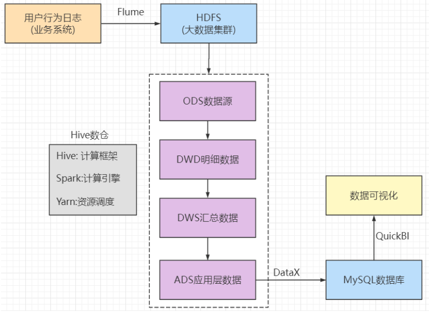
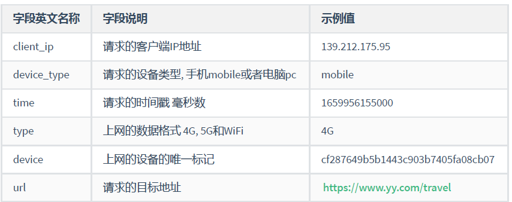
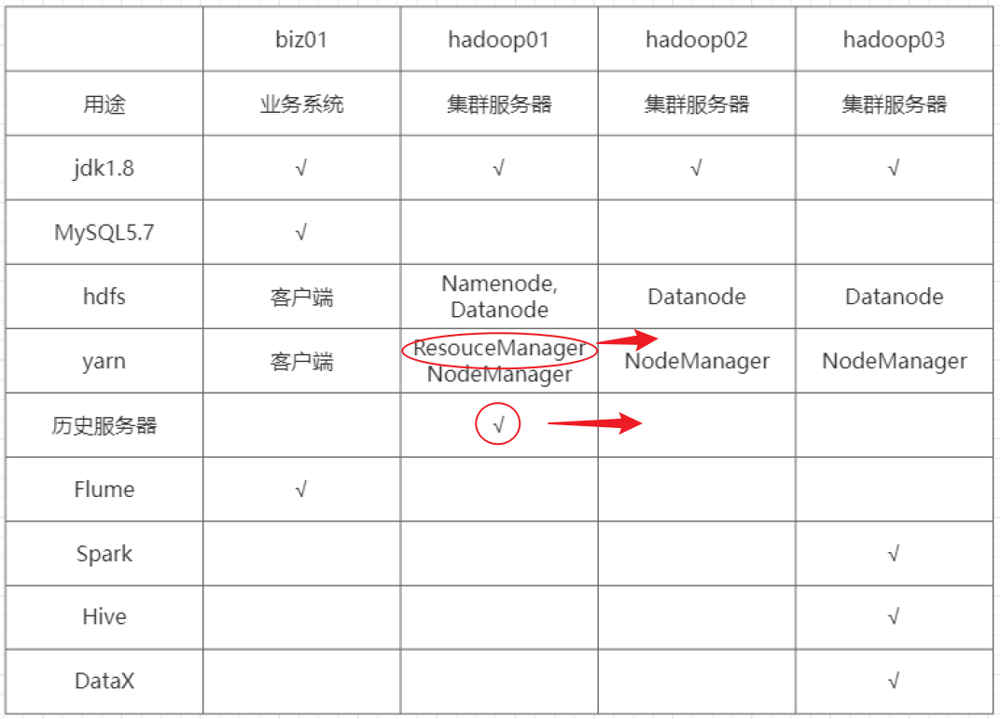
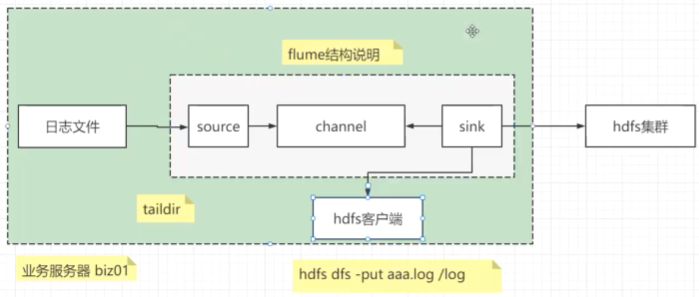
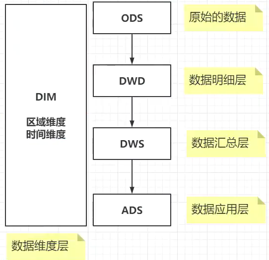
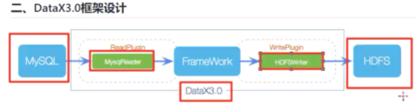

# 一.项目介绍

### （一）项目价值：

​	1.为相关统计部门提供数据支持, 比如上网的用户时长, 上网的用户人数, 上网模式的占比等等

​	2.为行业发展的预测提供数据支撑

​	3.为企业发展提供数据支撑, 分析每个网站的访问情况

### （二）项目系统流程分析



Flume：日志收集工具。通过从业务系统上收集数据发送到HDFS集群上。

数据仓库（图中虚线处）：

- ODS数据源：源数据，就是从HDFS上取出来的数据。
- DWD明细数据：会对源数据进行字段的处理，通过加减字段达到业务要求。
- DWS汇总数据：按照天数对业务数据进行汇总。
- ADS应用层数据：通过查询语句对汇总数据进行查询。

DataX：阿里产品，用来将数据交互到MySQL数据库中。因为学hive时知道hive内置的数据库只允许单用户访问，所以要扩展为mysql。DataX就解决了处理数据交互到数据库上的问题。

QuickBI：数据可视化工具。

### （三）数据格式说明



日志格式用JSON存储：

```json
{
	"client_ip": "139.212.175.95",
	"device_type": "mobile",
	"time": 1659959785000,
	"type": "5G",
	"device": "cf287649b5b1443c903b7405fa08cb07",
	"url": "https://www.yy.com/travel"
}
```

### （四）集群规划

|            | biz113（2G/4核/50G） | hadoop110（4G/4核/50G） | hadoop111（4G/4核/50G） | hadoop112（2G/4核/50G） |
| ---------- | -------------------- | ----------------------- | ----------------------- | ----------------------- |
| 用途       | 业务系统             | 集群服务器              | 集群服务器              | 集群服务器              |
| jdk1.8     | √                    | √                       | √                       | √                       |
| MySQL5.7   | √                    |                         |                         |                         |
| hdfs       | 客户端               | NameNode，DataNode      | DataNode                | DataNode，2NN           |
| yarn       | 客户端               | NM                      | RM，NM                  | NM                      |
| 历史服务器 |                      |                         | √                       |                         |
| Flume      | √                    |                         |                         |                         |
| Spark      |                      |                         | √                       |                         |
| Hive       |                      |                         | √                       |                         |
| DataX      |                      |                         | √                       |                         |



hadoop01、hadoop02、hadoop03都是功能服务器。biz01是作为数据服务器存在，由该服务器来获取业务数据和存储处理后的数据。


# 二、 搭建环境过程

## **1.基本配置**

​	创建一般用户shanjh，并配置sudoers；修改hostname和hosts，修改静态IP；关闭防火墙，卸载自带java

## **2.配置ssh和xsync同步**

```shell
# ssh需要先经过一次ssh，才会创建.ssh文件
cd .ssh
ssh-keygen -t rsa
ssh-copy-id hadoop110
```

复习Shell：

- $n、$#、$*$@、$?的含义。
- 三种执行shell脚本的方法：sh xxx.sh；(+x) ./xxx.sh ；source xxx.sh

## **3.配置java**

**解压、配置环境变量然后source**

## **4.在biz上装mysql。**

```mysql
# 查看初始化密码：
less /var/log/mysqld.log |grep pass;

# 修改用户密码
ALTER USER 'root'@'localhost' IDENTIFIED BY '123456';
#创建一个远程登录用户
create user 'root'@'%' identified by '123456';
## 设置远程登录权限
grant all privileges on *.* to 'root'@'%';
```

## **5.搭建hadoop集群，**

作好作用划分（nn在哪里，rm在哪里，nn在哪里）。配置4个site文件。

## **6.搭建redis环境**

**redis就是缓存数据库，存点日志啥的，默认端口为6379.**

```shell
# 启动redis
bin/redis-server conf/redis.conf
# 关闭redis
bin/redis-cli shutdown
# 登录命令
bin/redis-cli
```

## **7.flume**

flume作用：用于海量**日志**的采集、聚集和传输的系统。

*Q：为什么Java后台日志数据可以用put传到hdfs，那为什么还要flume。*

*A：put方式往往要求整个文件写完整个传到hdfs，但是日志是追加写的状态。所以用flume可以实现实时追加到hdfs上。而且，flume的实时追加在一定程度上可以缓解小文件问题。*

Flume的主要结构就是一个Agent由以下三部分组成：

- source：负责接收数据到Flume Agent组件。可以处理各种类型、各种格式的日志数据。
- channel：中间管道的缓冲区，允许Source和Sink运作在不同的速率上，是线程安全的。有两种Channel：Memory Channel（内存）和File Channel（磁盘）
- sink：不断地轮询Channel中的时间且批量地移除它们，并将这些时间批量写入到存储或索引系统、或者被发送到另一个Flume Agent。

传输单元是Event，由校验部分（header）和Body（数据）组成。



在Biz上配置flume，同时搭载Hadoop客户端，并配置ETL拦截器：

- 处理标准的json格式的数据, 如果格式不符合条件, 则会过滤掉该信息
- 处理时间漂移的问题, 把对应的日志存放到具体的分区数据中

对处理后的数据放到hdfs上去。

*Q：为什么我在Biz上只是安装了hadoop环境，并没有布置到集群上，也能通过hdfs dfs -put ls 命令查看到hdfs集群呢？*

*A：因为Biz上的hadoop环境是从hadoop110上拷贝过来的，只要在core-site中能过够找到只想正确hdfs地址的配置就能够访问到hdfs。*

实现ETL需要实现Intercept类，重写一个初始化、一个关闭、两个Intercept方法以及一个Builder。其中两个Intercept的方法是检查主体，Builder是构造拦截器实例和对参数进行配置。ETL的两端代码如下：

```java
public class ETLInterceptor implements Interceptor {

    @Override
    public void initialize() {
//    initialize 方法在拦截器初始化时被调用。
    }

    @Override
    public Event intercept(Event event) {

        byte[] body = event.getBody();
        String log = new String(body, StandardCharsets.UTF_8);

        if (JSONUtils.isJSONValidate(log)) {
            return event;
        } else {
            return null;
        }
    }

    @Override
    public List<Event> intercept(List<Event> list) {

        Iterator<Event> iterator = list.iterator();

        while (iterator.hasNext()){
            Event next = iterator.next();
            if(intercept(next)==null){
                iterator.remove();
            }
        }

        return list;
    }

    public static class Builder implements Interceptor.Builder{

        @Override
        public Interceptor build() {
            return new ETLInterceptor();
        }
        @Override
        public void configure(Context context) {

        }

    }

    @Override
    public void close() {

    }
}
```

```java
public class TimeStampInterceptor implements Interceptor {

    private ArrayList<Event> events = new ArrayList<>();

    @Override
    public void initialize() {

    }

    @Override
    public Event intercept(Event event) {

        Map<String, String> headers = event.getHeaders();
        String log = new String(event.getBody(), StandardCharsets.UTF_8);

        JSONObject jsonObject = JSONObject.parseObject(log);

        String ts = jsonObject.getString("time");
        headers.put("timestamp", ts);

        return event;
    }

    @Override
    public List<Event> intercept(List<Event> list) {
        events.clear();
        for (Event event : list) {
            events.add(intercept(event));
        }

        return events;
    }

    @Override
    public void close() {

    }

    public static class Builder implements Interceptor.Builder {
//        Builder 类负责将配置转换为 Interceptor 实例，并确保所有必要的初始化和配置都已完成。

//        build 方法用于创建 ETLInterceptor 的实例。在这个简单的实现中，它直接返回一个新的 ETLInterceptor 对象。
        @Override
        public Interceptor build() {
            return new TimeStampInterceptor();
        }

//        configure方法：configure 方法用于从 Flume 配置中读取参数并将其应用到拦截器实例中。
//        在这个例子中，这个方法没有具体实现，但在实际应用中，它通常用于读取配置文件中的参数并进行相应的设置。
        @Override
        public void configure(Context context) {
        }
    }
}
```


## **8.hive**

Hive是数据仓库中最常用的一个组件, MR比较慢，所以现在更多Hive的执行引擎用的比较多的有Tez,Spark

`Hive on Spark` 核心组件是Hive, 只是把运行的执行引擎替换为了Spark内存计算框架, 提高的程序运行的效率，其中Hive主要负责数据的存储以及SQL语句的解析。

`Spark on Hive` 核心组件是Spark, 只是把Spark的的数据存储使用Hive以及元数据管理使用Hive, Spark负责SQL的解析并且进行计算

在这里我们采用Hive-on-Spark的设计架构

配置的时候：

安装hive，配置环境变量，创建配置文件：要去关联mysql（biz113）,并将jdbc的依赖放到hive/lib下面的依赖中去。

> 配置文件中记得有：连接哪个机子的mysql、jdbc的名字、元数据在hadoop上的存储位置、mysql登录用户和密码、hiveserver2连接主机以及端口号10000。

初始化数据库：

```
schematool -initSchema -dbType mysql -verbose
```

## **9.spark**

安装spark、配置环境变量，配置spark_env文件，配置spark的历史服务器

### 修改配置文件

```shell
vim conf/spark-env.sh
# spark-on 配置
export HADOOP_CONF_DIR=/opt/module/hadoop-3.3.3/etc/hadoop
export YARN_CONF_DIR=/opt/module/hadoop-3.3.3/etc/hadoop
# spark的classpath依赖配置
export SPARK_DIST_CLASSPATH=$(/opt/module/hadoop-3.3.3/bin/hadoop classpath)
```

### 配置历史服务器

```shell
vim  spark-defaults.conf
# 默认提交到yarn集群运行
spark.master=yarn 
spark.eventLog.enabled=true
spark.eventLog.dir=hdfs://hadoop110:8020/spark/log
spark.executor.memory=1g
spark.driver.memory=1g
```

在hdfs上创建历史日志存放目录

```shell
hdfs dfs -mkdir -p /spark/log
```

### 配置环境变量

```shell
# vim /etc/profile.d/custom_env.sh
# spark
export SPARK_HOME=/opt/module/spark
export PATH=$PATH:$SPARK_HOME/bin
```

## **10、hive on spark**

> 问题记录
>
> 在执行插入语句时，遇到问题：FAILED: Execution Error, return code 30041 from org.apache.hadoop.hive.ql.exec.spark.SparkTask. Failed to create Spark client for Spark session 831b8e5e-06a4-41eb-9ffd-117e66c1496b
>
> 在/tmp/shanjh/hive.log 下看到错误信息：
>
> Caused by: java.lang.RuntimeException: java.util.concurrent.ExecutionException: java.util.concurrent.TimeoutException: Timed out waiting for client connection.
>
> 解决：hive-site那里jar包的依赖路径配错了

### 上传spark的依赖到hdfs

```shell
# 这里需要上传spark纯净的jar包目录(不含hadoop的jar包)
hdfs dfs -put  spark/jars/*  /spark/jars/
```

### 修改hive的配置文件

```xml
vim conf/hive-site.xml	
<!--Spark依赖位置（注意：端口号8020必须和namenode的端口号一致）-->
    <property>
        <name>spark.yarn.jars</name>
        <value>hdfs://hadoop110:8020/spark/jars/*</value>
    </property>
    <!--Hive执行引擎-->
    <property>
        <name>hive.execution.engine</name>
        <value>spark</value>
    </property>
    <!--Hive和Spark连接超时时间-->
    <property>
        <name>hive.spark.client.connect.timeout</name>
        <value>10000ms</value>
    </property>
```

### 使用开发工具Datagrip连接Hive

```shell
# 使用工具连接Hive，条件需要后台开启hiveserver2这个服务
mkdir /opt/module/hive/logs
nohup bin/hiveserver2 > /opt/module/hive/logs/hive.log  2>&1 &
```

> 问题：连接DG连接不上hiveserver2；
>
> Error: Could not open client transport with JDBC Uri: jdbc:hive2://localhost:10000: Failed to open new session: java.lang.RuntimeException: org.apache.hadoop.ipc.RemoteException(org.apache.hadoop.security.authorize.AuthorizationException): User: shanjh is not allowed to impersonate shanjh (state=08S01,code=0)
>
> 切换root和shanjh用户都不能访问到？
>
> 解决：在hadoop的core-site.xml配置文件中添加以下配置。注意：必须将root替换为自己的用户shanjh。最后用shanjh这个用户去连hiveserver2
>
> ```xml
> <property>
> 	<name>hadoop.proxyuser.shanjh.hosts</name>
> 	<value>*</value>
> </property>
> <property>
> 	<name>hadoop.proxyuser.shanjh.groups</name>
> 	<value>*</value>
> </property>
> ```

# 三、数据仓库

OLTP：具有数据一致性和事务操作。更适合对数据的插入删除  （ER建模）

OLAP：更适合分析，更快速的响应。（维度建模）



数据仓库：

- ODS**（Operational Data Store）**数据源：
- DWD**（Data Warehouse Detail）**明细数据：会对源数据进行字段的处理，通过加减字段达到业务要求。
- DWS**（Data Warehouse Summary）**汇总数据：按照天数对业务数据进行汇总。
- ADS**（Application Data Store）**应用层数据：通过查询语句对汇总数据进行查询。
- DIM，就是用来关联了关键字的其他表

> Q：为什么需要数据建模？
>
> A：

## （1）ODS层

目的：读入源数据，就是从HDFS上取出来的数据。需要对源数据的信息进行处理和清洗。

项目中的字段说明：

>  {
>   "client_ip": "171.15.167.183",
>   "device_type": "mobile",
>   "time": 1716353865000,
>   "type": "WIFI",
>   "device": "deee78ffb42640c0ab477723c548f852",
>   "url": "https://www.yy.com/travel?vid=18498351684554684&fr=hao213"
> }

- client_ip:客户端IP地址
- device_type:设备类型：mobile、PC等
- time:时间
- type: 上网类型 WiFi 4G 5G
- device: 设备号
- url:访问地址

### 1.项目要求：

url中只需要网址和不需要后面带的参数信息。另外，协议可能有http和https这个也不关心。

实际需求中还需要根据ip地址得到所在城市city信息。

**自定义Hive 的 UDF函数：**

- 自定义udf函数 可以通过ip获取到城市信息
- 自定义udf函数，可以通过对url进行处理 http https 统一为http，并对ur1后面的查询参数进行处理过滤
- 有两种继承方式**UDF**和**GenericUDF**，本项目继承 org.apache.hadoop.hive.ql.udf.generic.GenericUDF;

> 问题：hiveserver2连接不上spark：
>
> Error while processing statement: FAILED: Execution Error, return code 30041 from org.apache.hadoop.hive.ql.exec.spark.SparkTask. Failed to create Spark client for Spark session 
>
> Answer：没开spark。spark目录下sbin/start-all.sh。

**UDF中的基本结构：**

**ObjectInspector**
 在UDF中，ObjectInspector用于帮助Hive引擎在将HQL转成MR Job的时候**确定输入和输出**的数据类型。Hive语句会生成MapReduce Job执行，所以使用的是Hadoop数据格式，不是编写UDF的Java的数据类型，比如Java的int在Hadoop为IntWritable，String在Hadoop为Text格式，所以我们需要将UDF内的Java数据类型转成正确的Hadoop数据类型以支持Hive将HQL生成MapReduce Job。

**DeferredObject**

`DeferredObject`是Hive在执行UDF时传递实际参数的包装器。它允许延迟获取实际的参数值，这对于处理可能涉及复杂计算或延迟执行的数据流非常有用

1. **延迟计算**：`DeferredObject`封装了一个计算或数据获取的过程，允许在需要时才获取实际值。这样可以优化执行效率，尤其是在数据流处理中。
2. **数据获取**：`DeferredObject`提供了`get()`方法，用于获取实际的参数值。在UDF执行过程中，每次调用`evaluate`方法时，`DeferredObject`传递的参数实际是延迟计算的。

> 作者：Ros1n
> 链接：https://juejin.cn/post/6984580196594614308
> 来源：稀土掘金
> 著作权归作者所有。商业转载请联系作者获得授权，非商业转载请注明出处。

**ObjectInspector类下的各类继承类：**

- **PrimitiveObjectInspector**：Java的**String**和**numerical**类型都属于primitive types
- **ListObjectInspector**：对应Hive的**array**
- **MapObjectInspector**：对应Hive的**map**
- **StructObjectInspector**：对应Hive的**Structs**
- **StandardListObjectInspector**：相比ListObjectInspector支持更多方法，支持更多类型，同时支持java.util.List和java.util.Map，使用List表示Hive的Struct和Array类型，使用Map表示Hive的Map类型
- **StandardStructObjectInspector**：包含域的复杂对象，提供方法去访问域，这些方法可以通过读ObjectInspector类的源码了解
- **StandardMapObjectInspector** ObjectInspector创建实例的方法：StandardListObjectInspector.getList(inputObject), MapObjectInspector.getMap(object), ObjectInspecotor.get(object)，等等 。

**执行流程**

- 当Hive解析query时，会得到传入UDF参数的参数类型，并调用initialize()方法。针对该UDF的每个参数该方法都会收到一个对应的ObjectInspector参数，且该方法必须**返回一个ObjectInspector表示返回值**类型。通过调用该方法，Hive知道该UDF将返回什么数据类型，因此可以继续解析query。
- 对于Hive的每行记录，我们在`initialize()`方法内读取ObjectInspector参数，并执行传参的数量和数据类型的检查，**正确**时才进行计算；
- 在`evaluate()`方法中，我们使用initialize()方法里收到的ObjectInspector去读`evaluate()`方法接收的参数，即一串泛型Object（实际是DeferredObject），ObjectInspector解析Object并转成具体类型的对象具体的计算逻辑。每次Hive查询调用UDF时，都会调用此方法，并输出结果。
- `getDisplayString`方法返回UDF的字符串表示形式，通常用于调试和日志记录

> Q：从源数据中读出来的格式是什么样子的？
>
> A:  把应用场景带入到HQL中，源数据就是具体的传入到函数的参数。

```java
public class UrlUdf extends GenericUDF {

    @Override
    public ObjectInspector initialize(ObjectInspector[] objectInspectors) throws UDFArgumentException {
//        objectInspectors是使用该udf传入的所有参数
//        如：select urlUdf(url) from table_name;
//        这个例子中objectInspectors 就是一个参数url，对整个执行任务有且只调用一次Initialize()方法
        if(objectInspectors.length != 1){
            throw new UDFArgumentLengthException("Input size is not one.");
        }
        if(!objectInspectors[0].getCategory().equals(ObjectInspector.Category.PRIMITIVE)){
//            参数说明 1.argumentID: 表示出错的参数在传入参数列表中的位置。
//                   2. 报错信息。
            throw new UDFArgumentTypeException(0, "Input type is not String");
        }
//        利用工厂类返回处理数据的数据类型，告诉Hive这个数据类型的进一步处理
//        PrimitiveObjectInspectorFactory 是一个工厂类，用于创建各种 PrimitiveObjectInspector 实例。
//        这个类提供了静态方法来获取特定类型的 PrimitiveObjectInspector，如 javaIntObjectInspector。
        return PrimitiveObjectInspectorFactory.javaStringObjectInspector;
    }

    @Override
    public Object evaluate(DeferredObject[] deferredObjects) throws HiveException {
        if (deferredObjects[0].get() == null)
            return "";
        String url = deferredObjects[0].get().toString();
//        要求1：去除url中？的后半部分
        int index = url.indexOf("?");
        if (index > 0){
            url = url.substring(0, index);
        }
//        要求2：将所有的https替换成http
        if (url.startsWith("https")){
            url = url.replaceFirst("https", "http");
        }
//        加getBytes主要是保证前后的编码一致都是utf-8.不用的话底层也是会调getBytes但是类型不保证
        return new Text(url.getBytes(StandardCharsets.UTF_8));
    }

    @Override
    public String getDisplayString(String[] strings) {
        return "";
    }
}


public class IPLoc extends GenericUDF {
   //    要求：udf(url) -> address 
    public static List<Map<String, String>> mapList = new ArrayList<>();

    static {
//        将Redis中预先准备好的城市和省份传进来
        String host = "192.168.71.113";
        int port = 6379;
//        连接Redis
        Jedis jedis = new Jedis(host, port);
//        读取redis中的area
        Set<String> areas = jedis.smembers("area");
        for (String area : areas) {
//            转成JSON对象
            JSONObject json = JSON.parseObject(area);
            Map<String, String> map = new HashMap<>();
            map.put("city", json.getString("city"));
            map.put("province", json.getString("province"));
//            放到mapList中
            mapList.add(map);
        }
    }

    @Override
    public ObjectInspector initialize(ObjectInspector[] objectInspectors) throws UDFArgumentException {
        if (objectInspectors.length != 1){
            throw new UDFArgumentLengthException("Input size is not 1.");
        }
        if (!objectInspectors[0].getCategory().equals(ObjectInspector.Category.PRIMITIVE)){
            throw new UDFArgumentTypeException(0, "Input type is wrong.");
        }
        return PrimitiveObjectInspectorFactory.javaStringObjectInspector;
    }

    @Override
    public Object evaluate(DeferredObject[] deferredObjects) throws HiveException {
        if (deferredObjects[0].get() == null)
            return "";
        String url = deferredObjects[0].get().toString();
        String address = convertToAdd(url);
        return new Text(address.getBytes(StandardCharsets.UTF_8));
    }

    public  String convertToAdd(String url){
//        他将IP转换成Address其实是没有实现,只是随机匹配了一个地址返回
        int index = (int) (Math.random() * mapList.size());
        String rlt = mapList.get(index).get("city")+"_"+(mapList.get(index).get("province"));
        return rlt;
    }

    @Override
    public String getDisplayString(String[] strings) {
        return "";
    }
}
```

**注册使用UDF函数**
1.将开发好自定义UDF函数的项目打包成JAR包，并上传至服务器指定地址
2.创建临时UDF函数，指向JAR包地址

```
create temporary function my_lower as 'com.example.hive.udf.Lower' USING JAR 'hdfs:///path/to/jar';
```

3.创建UDF函数，指向JAR包地址（注意，永久UDF启用在某些集群配置下需要重启hiveserver才能使用）

```
create function my_db.my_lower as 'com.example.hive.udf.Lower' USING JAR 'hdfs:///path/to/jar';
```

4.使用UDF函数

```
hive> select my_lower(title), sum(freq) from titles group by my_lower(title);
```

5.删除UDF函数 DROP FUNCTION [IF EXISTS] function_name;
注意：重名UDF函数会导致报错，命名前先试试是否已有该命名。如果上面的步骤报错那么可以尝试重启一下hiveserver2

## （2）DWD明细表 

根据ODS的表数据获取更多明细信息组成DWD表

```mysql
-- DWD 创建用户数据的明细层
create table dwd_behavior_log (
    client_ip STRING comment '客户端IP',
    device_type STRING comment '设备类型 mobile PC',
    type STRING comment '4G 5G WiFi',
    device STRING comment '设备号',
    url STRING comment 'url地址',
    city STRING comment '城市 省份——城市',
    ts bigint comment '时间戳'
)COMMENT '页面启动日志表'
partitioned by (dt STRING)
stored as ORC
LOCATION '/behavior/dwd/dwd_behavior_log'
TBLPROPERTIES ("orc.compress"="snappy");
```

**对于分区字段的说明：**

在Hive中，表的分区字段**不能**作为表的实际字段存在（分桶可以）。这意味着，即使表的schema中没有定义某个分区字段，该字段仍然可以作为分区的一部分。在查询时，可以使用该分区字段进行数据查询和过滤。

```mysql
CREATE TABLE example_table (
  id INT,
  name STRING
)
PARTITIONED BY (dt STRING);
```

在这个定义中，dt是分区字段，但并没有在实际表列中定义。这种情况下，dt字段不会出现在表的列定义中，但它仍然是分区的一部分。
当你往这个表中插入数据时，插入语句需要包含分区字段：

```mysql
INSERT INTO example_table PARTITION (dt='2023-06-01')
VALUES (1, 'John Doe');
SELECT * FROM example_table WHERE dt='2023-06-01';
```

虽然dt不在表的列定义中，但你仍然可以使用它来分区数据并在查询中进行过滤。这是因为分区字段是在Hive元数据层次上进行管理的，而不是在表的实际数据存储中。

**插入数据**

```mysql
insert overwrite table dwd_behavior_log partition (dt)
    select get_json_object(line, '$.client_ip'),
           get_json_object(line, '$.device_type'),
           get_json_object(line, '$.type'),
           get_json_object(line, '$.device'),
           url_udf(get_json_object(line, '$.url')),
           split(get_city_by_ip(url_udf(get_json_object(line, '$.url'))), "_")[0],
           get_json_object(line, '$.time'),
           dt
    from ods_behavior_log
```

最后多出来的一个字段用于分区用。

> 报错：FAILED: Execution Error, return code 3 from org.apache.hadoop.hive.ql.exec.spark.SparkTask. Spark job failed during runtime. Please check stacktrace for the root cause.
>
> 解决不了。

## （3）DWS宽表汇总数据

- 建表语句

```sql
-- 定义表
DROP TABLE IF EXISTS dws_behavior_log;
CREATE EXTERNAL TABLE dws_behavior_log
(
    `client_ip`   STRING COMMENT '客户端IP',
    `device_type` STRING COMMENT '设备类型',
    `type`        STRING COMMENT '上网类型 4G 5G WiFi',
    `device`      STRING COMMENT '设备ID',
    `url`         STRING COMMENT '访问的资源路径',
    `city`        STRING COMMENT '城市',
    `ts`          bigint comment "时间戳"
) COMMENT '页面启动日志表'
    PARTITIONED BY (`dt` STRING)
    STORED AS ORC
    LOCATION '/behavior/dws/dws_behavior_log'
    TBLPROPERTIES ("orc.compress" = "snappy");
```

- 加载数据

```sql
--装载数据
insert overwrite table dws_behavior_log partition (dt)
select client_ip, device_type, type, device, url, area, city, province, ts, dt
from dwd_behavior_log;
```

## （4）创建维度表

### 时间维度表

- 建表语句

```sql
-- 创建时间维度
drop table if exists behavior.dim_date;
create external table dim_date
(
    date_id string comment  "日期",
    week_id string comment  "周",
    week_day string  comment  "星期",
    day string comment "一个月的第几天",
    month string comment "第几个月",
    quarter string comment "第几个季度",
    year string comment "年度",
    is_workday string comment "是否是工作日",
    holiday_id string comment "国家法定假日"
)
row format delimited fields terminated by '\t'
lines terminated by '\n'
location '/behavior/dim/dim_date';
```

- 加载数据

  直接把数据文件`dim_date_2022` 上传到`/behavior/dim/dim_date`即可

- 查询数据

  ```sql
  select * from dim_date
  ```

### 地区维度表

- 建表语句

  ```sql
  -- 创建地区维度表
  drop table if exists dim_area;
  create external table dim_area
  (
      city string comment "城市",
      province string comment "省份",
      area string comment "地区"
  )
  row format delimited fields terminated by '\t'
  lines terminated by '\n'
  location '/behavior/dim/dim_area';
  ```

- 加载数据

  直接把数据文件`dim_area` 上传到`/behavior/dim/dim_area`即可

## （5）ADS层统计数据

1. 用户城市分布

   

   - 创建表语句

   ```sql
   drop table if exists ads_user_city;
   create external table ads_user_city
   (
       city    string comment "城市",
       province STRING comment "省份",
       area     STRING comment "区域",
       dt      string comment "日期",
       count   bigint comment "访问数量"
   ) COMMENT '用户城市分布'
       ROW FORMAT DELIMITED FIELDS TERMINATED BY '\t'
       LOCATION '/behavior2/ads/ads_user_city';
   ```

   - 插入统计数据

   ```sql
   insert into ads_user_city
   select  t1.city,t2.province,t2.area,t1.dt,count(1)
   from dws_behavior_log t1 join dim_area  t2 on t1.city=t2.city
   group by t1.city, t2.province,t2.area, t1.dt;
   ```

   

2. 每个网站的上网的模式

   - 建表语句

   ```sql
   drop table if exists ads_visit_type;
   create external table ads_visit_type
   (
       url string comment "访问地址",
       type string comment  "访问模式 4G 5G Wifi",
       dt STRING comment "日期",
       month String comment "月度",
       quarter String comment "季度",
       count bigint comment "统计数量"
   )comment "网站访问的上网模式分布"
       ROW FORMAT DELIMITED FIELDS TERMINATED BY '\t'
       location "/behavior2/ads/ads_visit_type";
   ```

   - 插入数据

   ```sql
   insert overwrite table  ads_visit_type
   select t1.url, t1.type,t1.dt, t2.month, t2.quarter, count(1)
   from dws_behavior_log t1 join dim_date t2 on t1.dt=t2.date_id
   group by t1.url, t1.type, t1.dt, t2.month, t2.quarter;
   ```

3. 每个网站的上网类型

   - 建表语句

   ```sql
   drop table if exists ads_visit_mode;
   create external table ads_visit_mode
   (
       url         string comment "访问地址",
       device_type string comment "上网模式 移动 pc",
       dt          string comment "上网日期",
       count       bigint comment "统计数量"
   ) comment "网站的上网模式分布"
       ROW FORMAT DELIMITED FIELDS TERMINATED BY '\t'
       location "/behavior2/ads/ads_visit_mode";
   ```

   - 插入数据

   ```sql
   insert into table ads_visit_mode
   select url, device_type,dt, count(1)
   from dws_behavior_log
   group by url, device_type,dt;
   ```

## Datax的基本使用



## 在MySQL中创建对应的表结构

`用户城市分布`

```sql
CREATE TABLE `ads_user_city` (
  city varchar(80) DEFAULT NULL COMMENT '城市',
  province varchar(80) DEFAULT NULL COMMENT '省份',
  area varchar(80) DEFAULT NULL COMMENT '区域',
  dt varchar(80) DEFAULT NULL COMMENT '日期',
  count bigint DEFAULT NULL COMMENT '统计数量'
) ENGINE=InnoDB DEFAULT CHARSET=utf8 COMMENT='用户城市分布'
```

`网站访问的上网模式分布`

```sql
create table ads_visit_type(
url   VARCHAR(80) COMMENT '访问地址',
type  VARCHAR(80) COMMENT '访问模式',
dt  VARCHAR(80) COMMENT '日期',
month  VARCHAR(80) COMMENT '月度',
quarter  VARCHAR(80) COMMENT '季度',
count  bigint COMMENT '统计数量'
) COMMENT '网站访问的上网模式分布'
```

全量更新：将所有数据更新过来。

部分更新：将部分分区数据更新过来。

   ## 导出数据脚本

   - ads_user_city.json

```shell
{
    "job": {
        "setting": {
            "speed": {
                "channel": 1 #任务数量
            }
        },
        "content": [
            {
                "reader": {
                    "name": "hdfsreader",  # 插件
                    "parameter": {
                        "path": "/behavior/ads/ads_user_city/*",
                        "defaultFS": "hdfs://hadoop110:8020",
                        "column": [
                               {
                                "index": 0,
                                "type": "string"
                               },
                               {
                                "index": 1,
                                "type": "string"
                               },
                               {
                                "index": 2,
                                "type": "string"
                               },
                               {
                                "index": 3,
                                "type": "string"
                               },
                               {
                                "index": 4,
                                "type": "long"
                               }
                        ],
                        "sliceRecordCount": 10, # 每个任务数量
                        "fileType": "text",
                        "encoding": "UTF-8",
                        "fieldDelimiter": "\t"
                    },
			"writer": {
                "name": "mysqlwriter",
                "parameter": {
                    "writeMode": "insert",
                    "username": "root",
                    "password": "wolfcode2048",
                    "column": [
                        "city",
                        "province",
		    			"area",
		    			"dt",
		    			"count"
                    ],
                    "session": [
                    	"set session sql_mode='ANSI'"
                    ],
                    "preSql": [
                        "delete from ads_user_city"
                    ],
                    "connection": [
                        {
                            "jdbcUrl": "jdbc:mysql://192.168.71.113:3306/behavior?useUnicode=true&characterEncoding=utf-8&useSSL=false",
                            "table": [
                                "ads_user_city"
                            ]
                        }
                    ]
                }
            }
        }
    ]
}
```

运行示例：

```
python bin/datax.py  job/job.json
```

# 四、数据仓库相关问题

## 1.数据仓库的好处：

第一个是将复杂的需求简单化；我们通过将复杂的问题分解为多个步骤来完成，每一层只处理单一的步骤，比较容易和理解

第二个是提高数据的复用性；比如在已经得到最终结果之后，又需要中间层的一些数据，我可以直接查询中间层的数据，不必重新进行计算

**补充说一下：我觉得数据仓库就是一种以空间换取时间的架构！**


